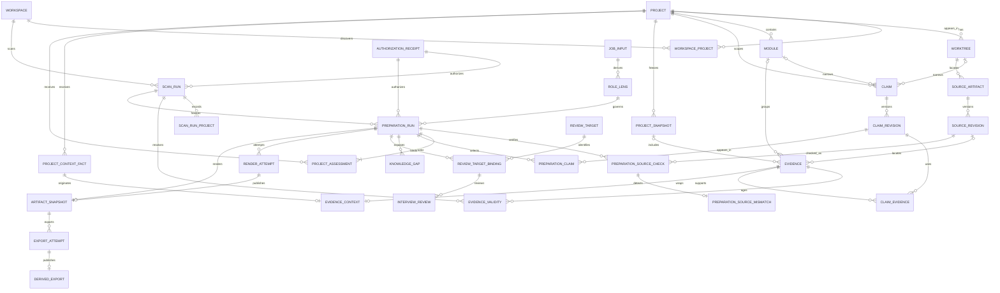

# GoodJob 证据模型

> 状态：待 Owner 核对  
> 权威范围：定义 SQLite 中的领域实体、身份与关系、证据/Claim 状态、增量版本和不可变快照契约  
> 上游：[产品需求](../10-product/product-requirements.md)、[系统设计](system-design.md)、[ADR-0003](../30-decisions/adrs/ADR-0003-evidence-pointers-without-source-snapshots.md)、[ADR-0004](../30-decisions/adrs/ADR-0004-dynamic-role-lens.md)、[ADR-0006](../30-decisions/adrs/ADR-0006-authorized-codex-analysis-and-external-git-metadata.md)、[ADR-0007](../30-decisions/adrs/ADR-0007-review-state-lineage-and-snapshot-integrity.md)  
> 下游：[扫描与分析](scanning-and-analysis.md)、[产物与学习闭环](artifacts-and-learning.md)、[验收基线](../40-delivery/acceptance-baseline.md)

## 1. 模型目标

证据模型把“仓库里有什么”“这些事实能支持什么说法”“某个岗位应如何取舍”和“用户已经复习到哪里”分成四层：

1. **观察层**：工作区、项目、工作树、模块、文件修订、扫描覆盖与问题；
2. **证据层**：可定位、可校验且不复制源码的 `Evidence`；
3. **叙事层**：由证据和用户上下文支持的版本化 `Claim`；
4. **准备层**：冻结的 `RoleLens`、`PreparationRun`、产物和复习记录。

扫描得到的基础事实不绑定岗位。应用软件工程师、中间件工程师、架构师或系统工程师等岗位都查询同一证据目录，由各自的 `RoleLens` 选择、排序和解释，而不是重复扫描或复制一套岗位数据库。

## 2. 核心概念与身份规则

### 2.1 Catalog、Revision 与 Snapshot

- **Catalog** 是可持续增长的实体身份目录，例如一个 Project 或一条逻辑 Claim。
- **Revision** 是不可变的内容版本，例如某路径在某次扫描看到的字节内容，或 Claim 的一次语义修订。
- **Snapshot** 是一次已完成运行对 Revision 的冻结引用。Snapshot 不复制源码，也不随 refresh 漂移。

所有外部引用都使用不透明稳定 ID；路径、名称和内容哈希是可查询属性，不充当跨实体的数据库主键。时间统一保存为 UTC ISO-8601，展示时再转换为本地时区。

### 2.2 项目与工作树身份

- Git 项目的身份键为规范化 `git common-dir` 实路径；同一 common-dir 的 linked worktree 归入同一 `Project`。
- 非 Git 项目的身份键为其被识别项目根的规范化实路径。
- 一个项目可被多个注册工作区发现，通过 `WorkspaceProject` 关联，不复制 Project。
- `Worktree` 以 Project + 工作树规范化根路径识别；分支、HEAD 和脏状态属于某次 `WorktreeObservation`，不属于永久身份。
- 工作区或项目根被移动后，首版可以产生新身份；不得仅因远端 URL 相同而自动合并两个本地项目。

### 2.3 文件与移动

- `SourceArtifact` 表示 Project + Worktree + 规范化相对路径这一逻辑位置。
- 文件内容或分析器版本变化时创建新的 `SourceRevision`；不得原地改写旧 Revision。
- 同项目内文件移动后，新路径产生新的 `SourceArtifact`。若内容哈希相同，可通过 `supersedes_artifact_id` 记录移动线索；旧路径在新快照中标为 `missing`，但历史引用仍有效。
- 路径必须相对对应工作树保存；数据库可以保存规范化绝对根用于本机重定位，但不得把任意路径扩展到授权工作区之外。

## 3. 实体定义

### 3.1 观察与扫描层

| ID | 实体 | 必需字段 | 关键约束 |
| --- | --- | --- | --- |
| `EVID-E01` | `Workspace` | `workspace_id`、`canonical_root`、`display_name`、`registered_at`、`config_revision` | 只代表 Owner 明确授权的扫描根；配置变更生成新 revision hash |
| `EVID-E02` | `Project` | `project_id`、`identity_kind`、`identity_key`、`display_name`、`first_seen_at` | `identity_kind=git_common_dir\|non_git_root`；身份键在本机唯一 |
| `EVID-E03` | `WorkspaceProject` | `workspace_id`、`project_id`、`relative_location`、`first_seen_run_id` | 多对多；说明项目如何被某工作区发现 |
| `EVID-E04` | `Worktree` | `worktree_id`、`project_id`、`canonical_root`、`git_dir` | Git 与非 Git 项目均至少有一个工作树视图 |
| `EVID-E05` | `WorktreeObservation` | `worktree_id`、`scan_run_id`、`branch`、`head_commit`、`dirty_state`、`history_basis`、可选 `external_git_dir/external_common_dir/external_metadata_receipt_id/external_metadata_confirmed_at/external_metadata_read_fields`、`observed_at` | 属于扫描尝试；不覆盖历史分支/HEAD 状态；外部元数据模式的 dirty state 是 `not_applicable`，read fields 只能记录实际读取项 |
| `EVID-E06` | `Module` | `module_id`、`project_id`、`module_key`、`name`、`kind` | `module_key` 是项目内稳定键；同文件可以归属多个逻辑模块，但须标主归属 |
| `EVID-E07` | `ModuleObservation` | `module_id`、`project_snapshot_id`、`relative_root`、可选 `manifest_evidence_id`、`adapter_id` | 保存本次快照中的模块边界；边界变化不改写历史 |
| `EVID-E08` | `SourceArtifact` | `artifact_id`、`project_id`、`worktree_id`、`relative_path`、`artifact_kind` | 不保存正文；Project + Worktree + relative_path 唯一 |
| `EVID-E09` | `SourceRevision` | `source_revision_id`、`artifact_id`、`content_sha256`、`byte_size`、`analysis_fingerprint`、`observed_at` | 不可变；不保存文件字节或源码片段 |
| `EVID-E10` | `ScanRun` | `scan_run_id`、`workspace_id`、`authorization_receipt_id`、`owner_process_identity`、`mode`、`change_detection_mode`、`config_revision`、`started_at`、可选 `finished_at`、`status` | `mode=full\|refresh`；PID+启动标识用于确定中断，终态后不可修改 |
| `EVID-E11` | `ProjectSnapshot` | `project_snapshot_id`、`project_id`、`scan_run_id`、`created_at`、`coverage_status` | 只有项目事务成功才创建；通过关联表冻结 Worktree/Module/Evidence revision |
| `EVID-E12` | `ScanRunProject` | `scan_run_id`、`project_id`、`snapshot_disposition`、`project_snapshot_id` | `fresh\|carried_forward\|failed_no_baseline\|excluded`；精确说明部分降级 |
| `EVID-E13` | `ScanIssue` | `issue_id`、`scan_run_id`、可选 `project_id/artifact_id`、`kind`、`severity`、`message`、`remediation` | 结构化记录权限、损坏、超限、解析或语言支持缺口；不可静默丢弃 |

`dirty_state` 是 `clean`、`modified`、`untracked`、`mixed` 或 `not_applicable`。`coverage_status` 是 `complete` 或 `partial`；“complete”只代表在当次配置和适配器能力下全部合资格输入被处理，不代表工具理解了所有业务语义。

### 3.2 证据与叙事层

| ID | 实体 | 必需字段 | 关键约束 |
| --- | --- | --- | --- |
| `EVID-E14` | `Evidence` | `evidence_id`、`project_id`、`acquisition_scope`、可选 `project_snapshot_id/preparation_run_id/module_id/source_revision_id/content_equivalence_key/query_reason`、`origin_kind`、`evidence_kind`、`locator`、`summary`、`commit_state`、`created_at` | 不可变事实指针；源码型证据必须能定位到 SourceRevision，用户陈述必须定位到 ContextFact；等价键只用于复用分析/折叠展示，不合并来源 |
| `EVID-E15` | `Claim` | `claim_id`、`claim_key`、`category`、`scope_kind`、`project_id`、可选 `worktree_id/module_id`、`created_at` | 逻辑叙事身份；正文不直接放在本记录中；分支特有事实必须有 worktree scope |
| `EVID-E16` | `ClaimRevision` | `claim_revision_id`、`claim_id`、`revision_no`、`statement`、`facets`、`support_level`、`review_semantic_projection`、`review_semantic_sha256`、`supersedes_id`、`created_at` | 不可变；任何语义修改创建新 revision；复习语义投影与文案分离并由 Repository canonicalize/hash |
| `EVID-E17` | `ClaimEvidence` | `claim_revision_id`、`evidence_id`、`relation`、`supported_facets` | 多对多；`relation=supports\|contradicts\|contextualizes` |
| `EVID-E18` | `ProjectContextFact` | `context_fact_id`、`project_id`、`fact_kind`、`statement`、`source_kind`、可选 `source_answer_id/config_revision`、`status`、`created_at` | 保存用户提供的业务、角色、指标、结果与学习上下文；refresh 不得覆盖 |
| `EVID-E19` | `ContextAnswer` | `answer_id`、`project_id`、`question_set_version`、`structured_answer`、`answered_at` | 保存项目级批量访谈回答；允许自由文本，但属于个人数据而非源码证据 |
| `EVID-E20` | `EvidenceContext` | `evidence_id`、`context_fact_id` | `evidence_kind=user_statement` 时的一对一来源关系；让用户上下文进入统一 ClaimEvidence 链路 |
| `EVID-E21` | `EvidenceValidity` | `scan_run_id`、`evidence_id`、`validity`、可选 `replacement_evidence_id`、`resolved_at` | 以扫描快照为坐标追加时效状态；不得回写 Evidence |

`origin_kind` 是 `source_revision`、`git_commit` 或 `context_fact`。`acquisition_scope` 是 `scan`、`preparation` 或 `context`：扫描器基础证据绑定 ProjectSnapshot；Codex 深读形成的精确文件证据绑定 PreparationRun，且其 SourceRevision 必须属于该运行冻结的 ProjectSnapshot；定向 Git 证据绑定 PreparationRun、commit locator 和 `query_reason`；用户陈述通过 `EvidenceContext` 指向 `ProjectContextFact`。Preparation-scope Evidence 是对冻结事实的追加定位，不得回写 ProjectSnapshot 或出现在其他运行中，除非后续运行重新校验并创建/复用合资格 Evidence。

`locator` 是结构化定位器。文件型证据至少包含相对路径，并可包含 `start_line/end_line`、symbol 或配置 key；Git 历史包含 commit；用户陈述包含 context fact ID。行号只用于导航；`source_revision_id` 和 `content_sha256` 才用于判断文件内容是否仍一致。

文件型 `content_equivalence_key` 为 `SHA256(analysis_fingerprint + normalized semantic locator + evidence_kind)`。同一内容出现在多个 worktree 时可以用它复用解析计算并在报告中折叠重复项，但每个 Evidence 仍保留自己的 SourceRevision/Worktree 来源。`Claim.scope_kind` 是 `project|worktree|module`：只有相关 worktree 的事实一致时才可提升为 project scope；分支间冲突必须保留为各自 worktree Claim，或形成明确 `conflicted` 的项目级 Claim。

`summary` 必须是对证据意义的短概述，不得是连续复制的源码或文档段落；长度上限为 500 个 Unicode 字符。完整函数体、完整文件、diff 正文、构建日志全文和大段文档均不得进入 `Evidence`、`ScanIssue` 或任意 Snapshot。

`ProjectContextFact.source_kind` 是 `config` 或 `context_answer`。`config.toml` 是 Owner 主动维护的稳定项目角色信息之当前事实源；进入准备运行时，Repository 按 `config_revision` 将其版本化投影为 ProjectContextFact。批量访谈答案则通过 ContextAnswer 产生事实。配置修订或新回答只能 supersede 旧事实，不能原地覆盖。

### 3.3 岗位准备与学习层

| ID | 实体 | 必需字段 | 关键约束 |
| --- | --- | --- | --- |
| `EVID-E22` | `JobInput` | `job_input_id`、`role_name`、可选 `jd_text/jd_source_path`、可选 `inferred_level/level_override`、`primary_language`、`created_at` | JD 与用户输入只保存在个人目录；显式职级覆盖推断值；首版主语言固定为 `zh-CN` |
| `EVID-E23` | `RoleLens` | `role_lens_id`、`job_input_id`、`dimensions`、`evidence_requirements`、`ranking_rules`、`output_sections`、`question_strategy`、`gap_rules`、`assumptions`、`generator_id`、`prompt_contract_version`、`created_at` | 一经绑定 PreparationRun 即不可变；不是固定岗位枚举；dimensions 非空、key 唯一、`weight_bps` 在 0..10000 且总和恰为 10000 |
| `EVID-E24` | `PreparationRun` | `preparation_run_id`、`workspace_id`、`scan_run_id`、`role_lens_id`、`authorization_receipt_id`、`status`、可选 `status_reason`、`started_at`、`last_transition_at`、可选 `finished_at` | 冻结本次岗位、扫描快照和使用的 ClaimRevision 集合；源码漂移以 `refresh_required` 终止，不隐式 refresh |
| `EVID-E25` | `PreparationClaim` | `preparation_run_id`、`claim_revision_id`、`project_id`、可选 `worktree_id/module_id`、`rank`、`section` | 保留跨项目排序和项目/工作树/模块追溯，不复制 Claim 正文 |
| `EVID-E26` | `KnowledgeGap` | `gap_id`、`gap_key`、`preparation_run_id`、`scope_kind`、`scope_id`、`dimension`、`description`、`severity`、`resolution_kind`、`status` | `scope_kind=role_global\|project\|module`；gap_key 在同一作用域/主题契约内稳定；状态可为 open/resolved/superseded |
| `EVID-E27` | `InterviewReview` | `review_id`、`preparation_run_id`、`review_target_binding_id`、`question_id`、`summary`、`mastery_level`、`weak_points`、可选 `next_review_at`、`created_at` | 不保存模拟面试完整对话；同一稳定目标的复盘追加新记录，不按题面模糊合并 |
| `EVID-E28` | `ArtifactSnapshot` | `artifact_snapshot_id`、`preparation_run_id`、`render_attempt_id`、`report_contract_version`、`report_bundle_sha256`、`manifest_sha256`、`report_markdown_path`、`resume_markdown_path`、`html_path`、`primary_language`、`created_at` | 每个 PreparationRun 至多一个成功中文主快照；完整报告、简历源稿与 HTML 同源且目录不可变；只有此实体可成为 `latest` 目标 |
| `EVID-E29` | `DerivedExport` | `derived_export_id`、`export_attempt_id`、`source_artifact_snapshot_id`、`source_report_bundle_sha256`、`source_projection_sha256`、`language`、`export_kinds`、`manifest_sha256`、`output_path`、`created_at` | 只由成功 ExportAttempt 创建的不可变派生物；首版仅 `language=en` 且 `export_kinds=resume,interview_qa`；不创建 HTML、不更新 `latest` |
| `EVID-E30` | `RenderAttempt` | `render_attempt_id`、`preparation_run_id`、`owner_process_identity`、`report_bundle_sha256`、`generator_version`、`started_at`、可选 `finished_at`、`status`、可选 `error_summary` | PID+启动标识用于确定中断；重试读取同一 ReportBundle hash；未成功不创建 ArtifactSnapshot/latest |
| `EVID-E31` | `ProjectAssessment` | `preparation_run_id`、`project_id`、`project_snapshot_id`、`snapshot_disposition`、`dimension_scores_milli`、`evidence_and_gap_refs`、`rationale`、`coverage_bps`、`base_score_milli`、`final_score_milli`、`rank` | 只为 fresh/carried-forward 项目创建且每个合资格项目恰有一条；Repository 用整数定点数重算连续排名，低分项目不得删除 |
| `EVID-E32` | `AuthorizationReceipt` | `authorization_receipt_id`、`receipt_kind`、`session_binding_digest`、`issuer_kind`、`scope_descriptor`、`notice_version`、`confirmed_at` | 不保存原始 capability；`issuer_kind=codex_task_runtime`；只有持有当前任务易失 capability、且 scope/notice 均匹配的请求有效 |
| `EVID-E33` | `ReviewTarget` | `review_target_id`、`target_kind`、`stable_subject_id`、`topic_contract_version`、`created_at` | `target_kind=claim\|topic`；稳定锚点只能是 `Claim.claim_id` 或版本化 `topic_key`，不得用题面/摘要模糊匹配 |
| `EVID-E34` | `ReviewTargetBinding` | `review_target_binding_id`、`review_target_id`、`preparation_run_id`、`subject_projection_sha256`、`subject_fingerprint`、`continuity_status`、`bound_at` | fingerprint 绑定 canonical ReviewSubjectProjection 而非 Revision/GAP ID；`continuity_status=new\|continued\|reassess_required` |
| `EVID-E35` | `PreparationSourceCheck` | `source_check_id`、`preparation_run_id`、`source_revision_id`、`phase`、`expected_sha256`、`observed_at`、`status` | `phase=preflight\|before_read\|commit`，`status=passed\|mismatch`；每个实际使用的 SourceRevision 必须覆盖相应阶段 |
| `EVID-E36` | `PreparationSourceMismatch` | `source_mismatch_id`、`source_check_id`、`mismatch_kind`、可选 `observed_sha256`、`detected_at` | `mismatch_kind=missing\|unreadable\|sha256_mismatch`；一旦存在即把运行转为 `refresh_required` |
| `EVID-E37` | `ExportAttempt` | `export_attempt_id`、`derived_export_id`、`source_artifact_snapshot_id`、`source_projection_sha256`、`generator_version`、`owner_process_identity`、`temp_relative_path`、`final_relative_path`、`started_at`、可选 `finished_at/error_summary`、`status` | `status=running\|succeeded\|failed\|interrupted`；发布子进程先落库再首次写盘；PID+进程启动标识防重用误判；路径由 attempt ID 唯一归属 |

`AuthorizationReceipt.receipt_kind` 是 `source_analysis|external_git_relation_probe|external_git_metadata`。原始 `SessionCapability` 不是数据库实体：`ARCH-C01` 在当前 Codex task 首次授权前用密码学安全随机源生成至少 256 bit capability，并只保存在该 task 的易失编排状态。持久层仅保存：

```text
session_binding_digest = SHA256(
  "goodjob-session-binding-v1" + raw_session_capability
)
```

每个受保护请求都临时携带原始 capability；Repository 重新计算 digest 并以 constant-time compare 对照回执。原始值不得进入 SQLite、配置、argv、环境变量、stdout/stderr、诊断、manifest、产物或 Codex 可见文本；本地核心只可通过专用 stdin/继承文件描述符接收，且禁止记录完整请求载荷。Codex task 结束、编排状态丢失或运行时不能提供 task-scoped 易失状态时，能力立即失效并要求 Owner 重新确认，绝不能从 SQLite 恢复。该 capability 防止 GoodJob 在另一个 Codex task 中误复用回执，不构成对控制本机与数据库的 Owner 的安全沙箱。

`RoleLens.dimensions` 等结构化字段必须被当作版本化值对象保存，而非依赖当前 Skill 中的模板重新计算。`JobInput.jd_text` 可以保存用户主动提供的完整 JD，因为它不是扫描到的项目源码；如通过路径提供，应同时保存当次内容哈希，避免后续文件变化导致镜头来源不明。`DerivedExport` 只投影源 `ArtifactSnapshot` 已冻结的事实，不重新扫描、生成 Claim 或改变 RoleLens。

`ClaimRevision.review_semantic_projection` 是结构化复习语义，不复制 statement。它至少包含稳定的 `concept_keys`、`mechanism_keys`、`behavior_contract_keys`、`tradeoff_keys`、`technology_identifiers`、影响复习判断的 facets/support/conflict/evidence-validity 状态，以及角色/结果事实锚点。Repository 校验其中的 Claim/Evidence 引用并对排序、大小写、空值和集合做 canonicalize，计算 `review_semantic_sha256`。纯文案改写、展示顺序、行号变化或等价 Evidence 替换不得改变投影；概念、机制、行为、取舍、实现/测试状态、冲突、证据时效或角色/结果锚点变化必须改变投影。

若 Repository 无法验证结构化投影与 statement/证据一致，不得沿用旧 hash：它将 `equivalence_status=unverified` 和 `fallback_semantic_sha256=SHA256(normalized statement + sorted fact/evidence anchor hashes)` 纳入 canonical projection。这样不依赖 Revision ID，但会保守触发重评；后续获得可验证结构化投影时再恢复正常等价判断。

`KnowledgeGap.gap_key = SHA256(project_id + scope_kind/scope_id + dimension + stable_gap_concept_key + gap_contract_version)`；`stable_gap_concept_key` 来自 RoleLens/ReviewTarget 的版本化概念键，不从 description 文案生成。跨运行同一缺口沿用 gap_key，状态/严重度/解决方式进入 ReviewSubjectProjection；概念键或契约版本变化则视为不同复习语义。

每个 `RoleLens.dimension` 至少含稳定 key、展示名、`weight_bps`、评价说明和所需证据类别。分值统一用整数定点数：`weight_bps` 与 `coverage_bps` 范围为 0..10000，`dimension_score_milli` 范围为 0..1000。RoleLens 的权重总和必须恰为 10000；不满足时在创建 PreparationRun 前拒绝，不自动归一化。

```text
base_score_milli =
  (Σ(weight_bps × dimension_score_milli) + 5000) // 10000
final_score_milli =
  (base_score_milli × coverage_bps + 5000) // 10000
```

`coverage_bps` 由冻结的 fresh/carried-forward、Evidence 时效、语言深读边界和关键缺口规则得出。Repository 验证范围和 Evidence/KnowledgeGap 引用，重算分数，并按 `final_score_milli` 降序、`project_id` 升序生成从 1 开始且无空洞的 rank。`failed_no_baseline` 与 `excluded` 只进入 Coverage，不得获得评分或排名；合资格集合为空时 PreparationRun 失败。

### 3.4 接口值对象

这些对象是组件间契约，不要求逐一映射为数据库表：

| 对象 | 必需内容 | 约束 |
| --- | --- | --- |
| `SessionAuthorizationEnvelope` | `authorization_receipt_id`、瞬时 `session_capability` | 包裹所有会读取/返回项目衍生数据或调用模型的请求；capability 只经专用 stdin/继承 FD 传给本地核心，不属于可序列化业务 payload，不得记录或持久化 |
| `PreparationRequest` | `request_id`、`workspace_ref`、`authorization_receipt_id`、`target_role`、可选 `jd_input`、可选 `level_override`、可选 `requested_exports`、`config_revision` | 创建运行时校验同会话源码分析回执并冻结具体 `scan_run_id`；主包语言固定为 `zh-CN`，请求英文时先完成主快照再派生导出 |
| `EvidenceQuery` | `scan_run_id`、`role_lens_id`、岗位维度、可选项目/模块/类型过滤、每组数量上限、可选定向历史目标与理由 | 查询必须可由同一快照与 RoleLens 重放；定向历史只返回 commit 元数据/路径候选并记录理由，不能以数据库当前指针替换显式 run |
| `EvidenceBundle` | `contract_version`、`scan_run_id`、`role_lens_id`、临时查询优先级、证据项/候选项、覆盖摘要、`ScanIssue` 摘要、深读建议 | 查询优先级只用于控制阅读预算，不是最终 ProjectAssessment；已持久化项含 ID，候选项含 candidate ID/来源；均含项目/worktree/模块、locator、状态与 hash/commit locator；不含源码正文 |
| `InterviewInput` | `mode=context\|mock_review`、`run_id`、`authorization_receipt_id`、项目/问题 ID、可选 `review_target_binding_id`、结构化答案或复盘 | context 产生 ContextAnswer；mock_review 必须绑定稳定 ReviewTarget 并产生 InterviewReview；后者不接受完整对话落库 |
| `EvidenceDraft` | `draft_id`、origin/evidence kind、冻结 SourceRevision + locator + observed hash，或定向 Git candidate + query_reason + 可选 object/diff hash、summary、可选 module/worktree | 只描述 Codex 已深读的精确证据；Repository 必须验证文件仍匹配冻结哈希、定位器在范围内，或 Git candidate/对象哈希来自本次受限查询；不得携带源码/diff 正文 |
| `ClaimDraft` | `draft_id`、category、scope_kind/ID、statement、proposed facets、`review_semantic_projection`、Evidence/EvidenceDraft 关系、可选个人归因类型 | 模型候选值；投影必须由相同证据支持；分支特有证据不得提交为无 worktree 的项目事实 |
| `AnalysisCommitRequest` | `preparation_run_id`、`role_lens_id`、EvidenceDraft、有序 ClaimDraft、ProjectAssessment 草稿、KnowledgeGap 草稿 | Repository 校验冻结范围、facet/反证/个人归因和 review semantic projection，canonicalize/hash 后原子提交；投影无法与 statement/证据一致时拒绝或保守换 hash |
| `ReviewSubjectProjection` | `review_target_id`、`topic_contract_version`、排序后的 `claim_atoms(claim_id, review_semantic_sha256, equivalence_status)`、排序后的 `gap_atoms(gap_key, dimension, severity, resolution_kind, status)`、`question_contract_version` | verified 时不含 Revision/Gap ID、题面或文案；unverified 时含 fallback semantic hash 并保守触发重评 |
| `ExportProjectionItem` | `source_item_id`、`export_kind`、中文源文本、Claim/Evidence/RoleLens 引用、数字/单位、技术标识、状态、角色与结果锚点 | 每条可导出的简历 bullet 或问答都是独立源项；锚点使用规范化结构，不靠翻译后文本反推 |
| `ReportBundle v1` | `contract_version`、`preparation_run_id`、canonical `bundle_sha256`、冻结 RoleLens、项目排序、ClaimRevision 投影、证据引用、缺口、覆盖、ReviewTargetBinding 与复习截点、`export_projection`、主语言 | Markdown 与 HTML 的唯一共同输入；canonical 序列化保证重试 hash 不漂移；只含呈现所需投影，不暴露 SQLite 表结构 |
| `TranslationExportRequest` | `source_artifact_snapshot_id`、`authorization_receipt_id`、`source_projection_sha256`、`target_language=en`、`export_kinds=resume,interview_qa` | 模型候选只存在当前 task 内存；首次写盘前由单个发布子进程创建 ExportAttempt，再校验并原子发布；不得读取数据库当前态或生成新 Claim |

上述 JSON 值对象必须拒绝未知主版本；同一主版本可增加接收方可忽略的可选字段。`ReportBundle` 的章节与视觉语义由[产物与学习闭环](artifacts-and-learning.md)负责，本文件只规定其溯源字段。

## 4. 关系图



## 5. 证据来源、状态与 Claim 语义

### 5.1 Evidence 来源

`evidence_kind` 采用可扩展字符串枚举；首版固定值如下：

| 值 | 含义 | 可直接支持的 Claim facet |
| --- | --- | --- |
| `implementation` | 当前源代码、迁移或可执行定义 | `implemented` |
| `test_definition` | 测试源码、fixture 接线或测试配置 | `test_defined`；只证明存在覆盖意图/定义，不证明已运行通过 |
| `test_result` | 可核验且带状态、时间及相关 commit/source hash 的测试结果元数据 | 通过结果可支持 `test_verified`；不能单独证明生产路径有效，不保存完整日志 |
| `result_record` | 可核验的 benchmark、迁移、发布或业务结果元数据 | 可支持客观 outcome/metric Claim；不能单独把结果归因给 Owner，不保存完整数据集 |
| `manifest` | 依赖、模块与工具链清单 | `documented`，并为技术栈提供上下文 |
| `configuration` | 构建、部署、CI、运行配置 | 对实现或运行方式提供支持，不能单独证明业务结果 |
| `documentation` | 描述性文档 | `documented` |
| `plan` | 计划、任务卡、设计草案或未落地规范 | `planned` |
| `git_history` | commit 元数据、作者、时间与变更范围 | 提供历史上下文；不能单独证明用户主导 |
| `user_statement` | 由 `EvidenceContext` 指向 `ProjectContextFact` 的用户背景 | `user_reported`，以及贡献/结果叙事上下文 |

代码与测试的 `commit_state` 必须是 `committed`、`modified`、`untracked`、`historical` 或 `not_applicable`。未提交内容可以支持“当前工作树已实现/正在实现”，但产物必须展示其未提交状态，不得伪装为已经交付的历史结果。

### 5.2 Evidence 时效

文件/Git Evidence 的 `validity` 不是 Evidence 上的可变字段，而是 `EvidenceValidity` 相对于某个 ScanRun 的解析结果：

- `current`：定位器与当前 SourceRevision 哈希一致；
- `stale`：同路径已出现新 Revision，或分析器/配置 revision 已变化；
- `missing`：原路径当前不存在，但历史元数据仍可追溯。

用户陈述的时效由 `ProjectContextFact.status=current|superseded|withdrawn` 解析。Codex 在把任一证据用于新的准备运行前必须校验其相对于该运行所引用 ScanRun/配置 revision 的状态。如果只能使用 `stale/missing/superseded` 历史证据，Claim 与产物必须显示该限制；不得依据旧摘要静默生成当前事实。

### 5.3 Claim 分类与 facet

`Claim.category` 首版支持：`technology`、`business`、`architecture`、`implementation_method`、`challenge`、`tradeoff`、`contribution`、`outcome`、`learning`、`knowledge_gap`。分类用于组织，不改变证据门槛。

`ClaimRevision.facets` 是集合而非单一最高状态，可包含：

- `implemented`：至少一个当前 implementation Evidence；
- `test_defined`：至少一个当前 test_definition Evidence，且 Claim 同时具备 implementation 支持；
- `test_verified`：至少一个通过的 current test_result Evidence，能关联相关 implementation revision/commit；测试定义或描述性文档不足以成立；
- `documented`：文档、manifest 或 configuration 对其有明确描述；
- `planned`：仅由 plan/documentation 表明未来意图；
- `user_reported`：由用户上下文支持，但仓库中未必能独立验证。

`support_level` 为 `single_source`、`cross_checked`、`user_confirmed` 或 `conflicted`。独立的代码 + 测试/配置证据可形成 `cross_checked`；关联用户上下文可形成 `user_confirmed`；存在有效反证时必须为 `conflicted`，不能仅通过调低置信度隐藏冲突。

### 5.4 能力叙事与个人归因

- 全项目的可读实现均可形成“我能解释/可复习其实现方式”的 capability-style `learning` 或 `implementation_method` Claim。
- “我实现”需要 implementation Evidence，且必须经 `ClaimEvidence -> EvidenceContext` 关联 `fact_kind=role|ownership` 的当前 `ProjectContextFact`，或关联可核验的个人角色 Evidence；如果实现位于未提交工作树，必须显示 `commit_state`。
- “我负责/主导”必须经 `ClaimEvidence -> EvidenceContext` 关联 `fact_kind=role|ownership` 的当前 `ProjectContextFact`。
- 客观的项目结果可由当前 `fact_kind=outcome|metric` 的 `ProjectContextFact`，或项目中可核验的结果/指标 Evidence 支持。“我推动/取得某结果”还必须关联当前 `fact_kind=role|ownership` 的 ProjectContextFact 或可核验个人角色 Evidence，把该结果与用户职责明确连接；仓库指标名或 Git 作者信息不足以单独完成个人归因。
- Git 作者只用于检索贡献线索。GoodJob 不按作者排除代码，也不自动把某作者的提交等同于用户个人贡献。
- Codex 可从实现证据归纳“可复习/可讲解的学习要点”和客观“如何实现”，分别落为 `learning` 与 `implementation_method` Claim。“我当时学到了……”这类过去式个人复盘还必须关联当前 `fact_kind=learning` 的 ProjectContextFact；否则只能输出候选学习要点。

## 6. 增量与快照契约

### 6.1 分析身份

`SourceRevision.content_sha256` 是原文件字节的 SHA-256。扫描器可以用路径、大小、`mtime_ns` 或 Git 状态做候选优化，但这些快捷属性不能替代内容身份。证据分析身份为：

```text
analysis_fingerprint = SHA256(content_sha256 + adapter_id + adapter_version + config_revision)
```

同一 SourceArtifact、`analysis_fingerprint` 与结构化 locator 的 Evidence 应复用既有不可变记录；内容、分析器或配置任一变化都产生新的 SourceRevision/Evidence。不同 worktree 的 SourceArtifact 不共享 Evidence 身份，即使内容相同，也只通过 `content_equivalence_key` 复用解析结果和折叠展示。文件的 `mtime_ns`、大小和 Git 状态只可用于 `fast` 模式筛候选；`verify_content` 必须对所有合资格文件重新计算 SHA-256。任一模式在准备阶段都必须执行 preflight、before_read、commit 三阶段精确校验。

### 6.2 项目事务与部分失败

一个 `ScanRun` 对每个 Project 单独提交事务：

- 成功：创建新的 `ProjectSnapshot`，`ScanRunProject=fresh`；
- 失败且有旧基线：引用最近一个已完成 ProjectSnapshot，标记 `carried_forward`，并记录本次 `ScanIssue`；
- 失败且无旧基线：不创建空快照，标记 `failed_no_baseline`；
- 按配置明确排除：标记 `excluded` 并记录规则来源。

因此 `ScanRun.status=completed` 仅在所有纳入项目均为 fresh；存在 carried-forward、failed-no-baseline 或未解决 issue 时为 `partial`；无法建立工作区或没有任何可用项目快照时为 `failed`。失败事务不得删除或改写上一个已发布 ProjectSnapshot。

### 6.3 准备快照

`PreparationRun` 必须引用一个终态 `ScanRun`，并冻结：

- 本次 `RoleLens`；
- 每个项目所用的 `ProjectSnapshot` 及其 fresh/carried-forward 状态；
- 被选中的 `ClaimRevision`、Evidence 和 ProjectContextFact 版本；
- 知识缺口、覆盖摘要和输出语言；
- 报告契约版本与生成器版本。

refresh 不得更新已完成 PreparationRun。想采用新源码、新 RoleLens、修订后的 Claim 或补充访谈信息，必须创建新的 PreparationRun；历史 ArtifactSnapshot 保持不变。

PreparationRun 只为其 `ScanRunProject.snapshot_disposition=fresh|carried_forward` 且 `project_snapshot_id` 非空的项目建立 `ProjectAssessment`。`failed_no_baseline` 与 `excluded` 只进入 Coverage。准备开始前为所有候选 SourceRevision 记录 `preflight` 检查；Codex 打开原文件前记录 `before_read` 检查；`record_analysis` 原子提交前记录 `commit` 检查。任何缺失、不可读或 SHA-256 不一致都会创建 `PreparationSourceMismatch`，把运行转为终态 `refresh_required`，不隐式扫描、不创建新 Evidence/Claim/Assessment/Artifact，也不改变 `latest`。

复习状态通过 `ReviewTarget` 跨快照连续，而不是依赖问题文本相似度或 Revision ID。Repository 先 canonicalize `ReviewSubjectProjection`，再定义：

```text
subject_projection_sha256 = SHA256(canonical ReviewSubjectProjection JSON)
subject_fingerprint = SHA256(
  review_target_id
  + subject_projection_sha256
  + topic_contract_version
)
```

Projection 使用稳定 `claim_id + review_semantic_sha256` 与 `gap_key + 结构化状态`，不使用 ClaimRevision ID、KnowledgeGap ID、statement、题面或行号。因此纯改写或等价证据替换保持连续；概念、机制、行为契约、取舍、实现/测试/冲突/证据时效、角色/结果锚点、缺口状态或题目契约发生实质变化时必须重评。同一 `review_target_id + subject_fingerprint` 可把截止本运行创建时间之前的最新复盘作为 `continued` 投影；目标相同但指纹变化时仅保留历史并标 `reassess_required`；无法可靠构造新投影时也必须保守重评。项目、作用域或 topic key 不同绝不合并。复盘更新通过 Skill/Python 写库后，Owner 显式创建新的 PreparationRun；它可以复用原 ScanRun，旧 ArtifactSnapshot 仍不可变。

### 6.4 运行状态机

`ScanRun`：

```text
running -> completed | partial | failed | interrupted
```

`PreparationRun`：

```text
collecting -> analyzing | awaiting_context | refresh_required | failed | interrupted
awaiting_context -> analyzing | refresh_required | cancelled
analyzing -> ready | refresh_required | failed | interrupted
ready -> rendering
rendering -> completed | partial | render_failed
render_failed -> rendering
```

`ExportAttempt`：

```text
running -> succeeded | failed | interrupted
```

`awaiting_context` 只在关键上下文缺口会改变材料时使用；它持久化且不持有写锁、不按时间过期，但只能由持有原 SessionCapability 的同一 Codex task 回答、跳过或取消。task/capability 丢失时不能恢复模型分析；新 task 经 Owner 重新授权后只能显式执行 `abandon_and_restart`，把旧运行标为 interrupted，再复用其终态 ScanRun 与已持久化上下文创建新 PreparationRun。`ready` 表示分析集已冻结；render_failed 可用新 RenderAttempt 重试同一 bundle。所有失败/中断/取消/刷新要求都不得创建 ArtifactSnapshot 或更新 latest。

新写进程取得 OS 排他锁后，只对记录了 `owner_process_identity` 且 PID+启动标识确认进程不存在的 ScanRun/RenderAttempt/ExportAttempt 自动标 `interrupted`。PreparationRun 不按 PID/时间自动恢复：同 capability 可继续；新 task 必须由 Owner 显式 `abandon_and_restart`。事务提交后，只清理实体预登记、能由 run/attempt ID 证明归属且位于个人数据目录内的路径；无 DerivedExport 的 interrupted final path 可清理，已有 DerivedExport 绝不清理。interrupted ScanRun 不能成为准备基线；新运行可复用历史终态快照。

## 7. 数据保留与写入规则

| ID | 不变量 |
| --- | --- |
| `EVID-INV-01` | SQLite 不保存源码全文、完整函数体、diff/日志全文或自动截取的大段文档；Evidence 只保存指针、哈希、状态与短概述。 |
| `EVID-INV-02` | 任一源码型 Evidence 必须关联 SourceRevision；路径或行号本身不是内容身份。 |
| `EVID-INV-03` | 计划/文档证据不能单独产生 `implemented`、`test_defined` 或 `test_verified`；test_definition 不能单独产生 `test_verified`。 |
| `EVID-INV-04` | 关键 Claim 至少有一条 `supports` 关系；有未解决的 `contradicts` 时必须标 `conflicted`。 |
| `EVID-INV-05` | 强个人归因必须由 `ClaimEvidence -> EvidenceContext -> ProjectContextFact` 或可核验个人角色 Evidence 支持；`record_analysis` 必须执行该门槛，扫描器不得从 Git 作者自动创造 ownership/outcome 事实。 |
| `EVID-INV-06` | refresh 只能追加 Revision/Snapshot 或更新当前指针，不能修改已冻结的历史事实。 |
| `EVID-INV-07` | 项目扫描失败时保留上一成功快照并标 carried-forward；不得把旧数据冒充 fresh。 |
| `EVID-INV-08` | 项目访谈回答和模拟面试复盘属于个人数据，扫描 refresh 不得覆盖或删除。 |
| `EVID-INV-09` | 模拟面试只保存结构化复盘，不保存完整对话；项目上下文访谈允许保存用户主动给出的答案。 |
| `EVID-INV-10` | ArtifactSnapshot 必须可从冻结的 PreparationRun 和对应版本化渲染器解释来源；`latest` 只指向最新成功中文主快照。 |
| `EVID-INV-11` | DerivedExport 只引用一个既有 ArtifactSnapshot 和一个 succeeded ExportAttempt，不改变源快照、PreparationRun 或 `latest`；失败/中断只留下 attempt 诊断，不得留下可见半成品。 |
| `EVID-INV-12` | ClaimDraft 不是持久化 Claim；只有整批通过冻结范围、facet、反证和个人归因校验的 AnalysisCommitRequest 才能创建 ClaimRevision/PreparationClaim。 |
| `EVID-INV-13` | Evidence/Claim/Context 文本均是不可信数据；持久化只保存数据，不允许其指定命令、SQL、文件目标或 HTML 执行语义。所有数据库写入使用参数化语句。 |
| `EVID-INV-14` | 相同内容可复用解析但不得合并 worktree provenance；相互冲突的工作树状态不能拼接为一个无作用域的“当前项目事实”。 |
| `EVID-INV-15` | 深读与定向历史只可通过 EvidenceDraft 进入 record_analysis；候选查询来源校验失败时整批不得提交；文件缺失、不可读或哈希不符时运行必须转为 `refresh_required`，ProjectSnapshot 保持不变。 |
| `EVID-INV-16` | record_analysis 成功后的分析集不可改写；渲染失败只追加 RenderAttempt 并可重试同一 canonical ReportBundle hash，不得重新解释 Claim 或更新 latest。 |
| `EVID-INV-17` | 每个 fresh/carried-forward 且有 ProjectSnapshot 的合资格项目必须恰有一个 ProjectAssessment；总分/连续排名由冻结 RoleLens 定点权重和覆盖规则重算，任何合资格项目不得因低分或缺口被静默删除。 |
| `EVID-INV-18` | 工作区可读、配置、项目文本、SQLite 记录或历史回执均不能生成/恢复 SessionCapability；只有当前 Codex task 易失状态中的原始 capability、匹配 digest/scope/notice 的回执才有效，丢失时必须重新确认。 |
| `EVID-INV-19` | `.git` 标记只是根外路径候选；根内 candidate inspection 后，首次精确回执绑定 marker kind 与候选且只允许探测关系文件，解析出规范化 git-dir/common-dir 与目录身份后还必须取得第二个精确 metadata 回执；外部阶段不启动 Git，最终只保存关系、HEAD/ref，index/dirty 与源码 commit state 标为不可用，绝不读取根外历史、对象、blob、diff、配置或源码。 |
| `EVID-INV-20` | ReviewTarget 必须锚定稳定 Claim ID 或版本化 topic key；fingerprint 不能直接使用 Revision/Gap ID 或题面。verified 投影按结构化语义判断；unverified 投影必须加入 statement+事实锚点 fallback hash 并保守重评。 |
| `EVID-INV-21` | 每个被使用的 SourceRevision 必须通过 preflight、before_read、commit 三阶段校验；任一 mismatch 都以 `refresh_required` 原子终止准备，不允许隐式 refresh 或半提交。 |
| `EVID-INV-22` | RoleLens 权重总和必须恰为 10000；ProjectAssessment 只能覆盖合资格项目，采用指定整数公式和稳定连续排名，failed/excluded 只进入 Coverage。 |
| `EVID-INV-23` | 英文导出的 requested kind 源项/目标项集合必须完全相等，数字、单位、技术标识、状态、角色与结果锚点规范化后必须相等；校验保证结构化事实保真，但不宣称证明全部自然语言语义。 |
| `EVID-INV-24` | 首版不自动删除个人数据或历史快照；只报告各存储区用量。未来清理必须是独立、显式、可预览且不破坏仍被快照引用的数据操作。 |
| `EVID-INV-25` | 英文候选在 task 内存生成；首次文件写入前，单个持锁发布子进程必须持久化 ExportAttempt/owner identity，并只写预登记 attempt-scoped 路径。成功发布 DerivedExport；失败/中断只按账本清理。 |

数据库保存 `schema_version`，迁移和任何写操作必须先取得 OS 管理的非阻塞排他文件锁。锁的真相是持锁文件描述符及内核状态；PID、启动时间和命令只作诊断，绝不按 mtime 超时删除或“偷锁”。未取得锁返回 `writer_busy` 且不执行任何写入。未知新 schema 的旧版本 Skill 只能拒绝写入并给出升级提示，不得尝试降级或部分理解。人工数据与生成数据必须有来源字段；任何自动重新分析只能 supersede 旧记录，不能覆盖用户回答。

## 8. 需求到模型映射

| 需求 | 核心实体/约束 | 可验证结果 |
| --- | --- | --- |
| `FR-01`、`FR-02` | `SessionCapability`、`AuthorizationReceipt`、`JobInput`、`EVID-INV-18` | 回执只能由当前 Codex task 的易失 capability 使用；不可读 JD 不生成半成品岗位输入或运行 |
| `FR-03`、`FR-04` | `Workspace` 至 `ProjectSnapshot`、`EVID-INV-06/07` | Git/非 Git、worktree、模块可追踪；显式 refresh 追加新版本 |
| `FR-05`、`FR-06` | `JobInput`、`RoleLens`、`PreparationRun`、`PreparationClaim` | 同一证据图谱可被动态岗位镜头重排且不重复扫描 |
| `FR-07`、`FR-10` | `ProjectContextFact`、`ContextAnswer`、`EvidenceContext`、`EVID-INV-05` | 能力叙事不冒充主导/结果；项目级回答可持续复用 |
| `FR-08`、`FR-09` | `ProjectAssessment`、`PreparationClaim`、`KnowledgeGap`、`EVID-INV-22` | 合资格项目跨项目排名可解释且保留追溯；failed/excluded 只出现在覆盖区，低分合资格项目不丢失 |
| `FR-11` | `Evidence`、`ClaimRevision`、`ClaimEvidence` 与状态枚举 | 每条关键结论能展示来源、实现/测试/计划和提交状态 |
| `FR-12`、`FR-13` | `ArtifactSnapshot`、`ExportAttempt`、`DerivedExport`、`ExportProjectionItem`、`EVID-INV-23/25` | 英文从冻结源项派生、事实锚点可机检，导出中断可精确恢复；latest 可追到主 run ID |
| `FR-14` | `ReviewTarget`、`ReviewTargetBinding`、`ReviewSubjectProjection`、`InterviewReview`、`EVID-INV-20` | 纯文案修订保持连续，实质复习语义变化要求重评，完整对话不落库 |
| `FR-15` | `ScanIssue`、`ScanRunProject`、`KnowledgeGap` | 部分失败不丢旧基线且在产物中可见 |
| `NFR-01`、`NFR-02` | `AuthorizationReceipt`、`SourceRevision`、`Evidence`、`EVID-INV-01/02/18/19` | 授权边界显式；本地最小持久化；根外 Git 不扩张为源码或历史读取 |
| `NFR-04`、`NFR-05` | 分析 fingerprint、`PreparationSourceCheck/Mismatch`、运行状态机、不可变 Snapshot | 相同输入可复用；漂移要求显式 refresh；中断与失败不污染基线 |
| `NFR-06` | 全部实体位于外部个人数据目录、`EVID-INV-24` | Skill 重装不影响知识库；首版不自动删除，存储用量可见 |
| `NFR-07` | 可扩展 `evidence_kind`、adapter 字段、动态 RoleLens | 新语言或岗位不要求迁移一套平行核心模型 |
| `NFR-08` | `ClaimDraft` 校验、参数化持久化、ReportBundle 数据边界、`EVID-INV-13` | 项目/JD/模型文本不能改变命令、SQL、路径或呈现执行语义 |
