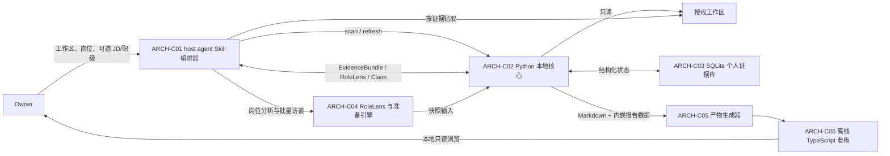

# GoodJob 系统设计

> 状态：待 Owner 核对  
> 权威范围：定义首版系统边界、运行时组件、组件职责、稳定接口、数据流与部署形态  
> 上游：[产品目标](../00-product/vision-and-goals.md)、[产品需求](../10-product/product-requirements.md)、[决策账本](../30-decisions/decision-log.md)  
> 下游：[证据模型](evidence-model.md)、[扫描与分析](scanning-and-analysis.md)、[产物与学习闭环](artifacts-and-learning.md)、[看板呈现契约](dashboard-design.md)、[验收基线](../40-delivery/acceptance-baseline.md)

## 1. 设计摘要

GoodJob 是一个由 host agent 显式调用的个人 Skill，而不是独立桌面应用。host agent 负责理解岗位、读取本地证据、生成叙事与开展访谈；随 Skill 分发的 Python 核心负责确定性的发现、索引、SQLite 持久化和产物编排；预构建的 TypeScript 前端只负责渲染无需服务的离线 HTML 看板。每个显式会话先形成范围级 `AuthorizationReceipt`，它确认 Owner 有权让当前 host agent 会话分析该工作区，但不重新定义 host agent 平台的数据边界。当前运行时支持 macOS 和 Linux（含 WSL2），由 [ADR-0009](../30-decisions/adrs/ADR-0009-cross-platform-runtime-security.md) 定义安全后端；原生 Windows 安全契约 [ADR-0011](../30-decisions/adrs/ADR-0011-native-windows-security-contract.md) 已接受，Phase 3-B 运行时当前仅为 PR #3 的未合入候选实现，在 `IMP-31` 真机验收完成前仍为 unsupported 并推荐 WSL2。

同一份岗位无关证据目录可以被不同 `RoleLens` 重排。源码仍以用户指定工作区内的原文件为事实源；数据库只保存证据指针、哈希、短摘要和结构化结论。版本化 Skill 目录与持续增长的个人数据目录严格分离。



## 2. 运行与部署边界

### 2.1 版本化 Skill 资产

开发期 Skill 位于 GoodJob 仓库的 `.agents/skills/goodjob-career-review/`；发布后安装到用户级 Skill 目录。版本化资产只包括：

- `SKILL.md` 与显式调用元数据；
- Python 源码、数据库迁移和确定性参考数据；
- 岗位分析参考框架；
- 预构建的 TypeScript/CSS/图标资源；
- 运行所需但不含个人信息的模板。

Skill 运行期间不得修改安装目录。升级、重装或删除 Skill 不得影响个人证据库与历史产物（ADR-0001）。

### 2.2 个人数据目录

默认数据根为平台感知路径（macOS: ~/.codex/goodjob-career-review/；Linux: ~/.local/share/goodjob-career-review/；legacy 目录存在时优先沿用），可由每次调用的显式 `data-dir` 覆盖。固定布局如下：

```text
~/.codex/goodjob-career-review/  (macOS 默认；Linux 为 ~/.local/share/goodjob-career-review/)
├── config.toml                 # config_revision、默认岗位、项目级排除规则
├── goodjob.sqlite3             # 证据、运行、访谈与复习状态
├── artifacts/
│   ├── <preparation-run-id>/   # 不可变的 report.zh-CN.md/resume.zh-CN.md/HTML/manifest 主快照
│   └── latest.json             # 原子更新的最新成功中文主快照指针
├── exports/
│   ├── .tmp/<export-attempt-id>/ # 按尝试归属、未发布的英文导出临时目录
│   └── <derived-export-id>/    # 从主快照派生的不可变英文材料
├── drafts/                     # Owner 显式导出的可编辑 Markdown 工作稿
└── locks/                      # OS 管理的单写者锁诊断文件；不承载业务数据或锁真相
```

个人目录不得进入 Skill 包或 GoodJob Git 仓库。`artifacts/` 保存中文主快照；`exports/` 的正式目录保存英文派生物，`.tmp/` 只保存可由 ExportAttempt 归属的未发布临时文件，两者都不保存源码副本；`drafts/` 中的人工工作稿不由 refresh 或 prepare 覆盖。`latest.json` 只指向最近一次成功渲染的中文 `completed` 或带明确缺口的中文 `partial` 主快照，失败运行和英文导出均不得覆盖它。首版不自动删除任何个人历史；每次 scan/prepare 显示 SQLite、artifacts、exports、drafts 的字节数和快照数量。

### 2.3 进程与网络边界

- Owner 提供的 `workspace_path` 仅定义本机文件范围。`ARCH-C01` 必须先取得当次 `AuthorizationReceipt(source_analysis)`，再让 host agent 或 Python 处理源码、源码衍生证据或既有项目材料；回执拒绝/缺失时不建立新运行。扫描器只可把 `.git` 标记当作不可信候选：先只检查根内标记，再以绑定 marker kind 与精确候选的 `external_git_relation_probe` 回执解析关系和目录身份；解析后展示 git-dir/common-dir、身份与字段并取得精确 `external_git_metadata` 回执。双向绑定通过后也只能用描述符直接读取关系与 HEAD/ref，不得启动外部 Git 或扫描根外项目内容、配置、index/dirty 或历史。
- Python 核心作为短生命周期子进程运行；首版没有守护进程、后台监听或常驻 HTTP 服务。Git 子进程在平台原生沙箱中运行：macOS 使用 `sandbox-exec` Seatbelt，Linux/WSL2 使用 `bwrap`（见 [ADR-0009](../30-decisions/adrs/ADR-0009-cross-platform-runtime-security.md)）。原生 Windows 后端固定为 WFP ALE dynamic filters + Job Object：直接定位并启动 `mingw64\bin\git.exe`，先为同一真实二进制安装并回读 filters，再以 `CREATE_SUSPENDED` 创建、加入 `ACTIVE_PROCESS=1` Job 后 resume；`cmd\git.exe` shim 禁止作为入口（见 [ADR-0011](../30-decisions/adrs/ADR-0011-native-windows-security-contract.md)）。任一后端不可用时 fail-closed。Windows 实现与真机 E2E 未全部通过前，平台选择器不得返回可执行后端，只返回 unsupported/WSL2 指引。
- SQLite 是唯一结构化持久层。前端不得直接打开或修改 SQLite。
- 离线 HTML 不请求远端 API、CDN、字体或分析服务，也不通过 `file://` 再读取外部 JSON；报告数据随 HTML 产物内嵌。
- GoodJob 不引入当前 host agent 会话之外的分析服务、源码上传通道或遥测。host agent 对源码的访问属于当前工作区会话中的直接读取，受该会话既有的数据边界约束；扫描器不额外复制或传输源码。GoodJob 不判断 Owner 的 NDA、版权或组织策略是否允许该会话分析或对外使用材料。

## 3. 组件职责

| ID | 组件 | 唯一职责 | 明确不负责 |
| --- | --- | --- | --- |
| `ARCH-C01` | host agent Skill 编排器 | 收集输入、在 host agent task 易失状态生成/持有 SessionCapability、取得会话/根外授权回执、调用本地核心、控制深读与访谈 | 持久化/显示/记录原始 capability，把路径可读性当授权，遍历全工作区，直接写 SQLite |
| `ARCH-C02` | Python 本地核心 | 项目发现、确定性扫描、增量索引、证据查询、运行状态与快照编排 | 自行推断岗位价值、冒充用户声明贡献、依赖常驻服务 |
| `ARCH-C03` | SQLite 个人证据库 | 保存证据图谱、回执的 session binding digest、运行/导出尝试、快照、结构化访谈、复习语义投影与状态 | 保存源码全文或原始 SessionCapability、作为前端运行时 API |
| `ARCH-C04` | RoleLens 与准备引擎 | 由 host agent 根据岗位/JD/职级构造镜头，按镜头排序证据、形成 Claim、识别知识缺口 | 把岗位限制为固定枚举、重新扫描同一工作区、把文档计划判作已实现 |
| `ARCH-C05` | 产物生成器 | 校验报告契约，生成中文报告/简历/HTML、工作稿、英文派生导出、manifest 和 `latest`；每次英文导出维护 ExportAttempt 与可恢复路径 | 改写 Claim、隐藏覆盖缺口、覆盖人工工作稿、让派生导出改写主快照 |
| `ARCH-C06` | 离线 TypeScript 看板 | 在浏览器内完成导航、搜索、筛选、证据展开和复习状态展示 | 访问网络、启动服务、持久化新的数据库状态或执行源码扫描 |
| `ARCH-C07` | Windows 平台安全后端 | 提供 WFP/Job/direct launcher、NT handle-relative FS、capability handle、进程身份、锁与 bounded-output；维护 Win32 handle 所有权 | 决定产品授权、回退到 pathname/无网络隔离后端、在未通过 IMP-31 时宣称 supported |

### 3.1 `ARCH-C01`：Skill 编排器

Skill 只能由用户显式调用（FR-01）。当前 host agent task 首次进入 GoodJob 授权流程时，编排运行时必须用密码学安全随机源生成至少 256 bit `SessionCapability`，只保存在 task-scoped 易失状态；Owner 确认范围后，Python 仅持久化其 domain-separated SHA-256 digest 到 `AuthorizationReceipt`。原始 capability 只能通过平台私有能力通道随受保护请求传递：POSIX 使用专用 stdin/继承 FD，原生 Windows 使用 allowlisted inherited HANDLE；它不能进入 argv、环境变量、数据库、GoodJob 日志、产物或用户可见输出，host agent task trace 仍受 host 既有边界约束。task 结束、状态丢失或运行时不支持该易失能力时必须重新确认，不能读取 SQLite 恢复旧 capability。

授权前必须显示规范化工作区、处理类别、GoodJob 本地持久化边界，并说明按证据打开的原文件会进入当前 host agent 会话的模型处理链路、其边界由当前产品/账户/工作区策略决定；Owner 确认后形成 `AuthorizationReceipt(source_analysis)`。一次准备会话随后形成 `PreparationRequest`：授权工作区、回执、主岗位、可选 JD、可选职级覆盖、可选英文导出请求和可选数据目录；首版主包语言固定为中文（FR-02、FR-13）。

编排器遵循固定顺序：确认输入与授权回执 → 确认或刷新索引 → 生成单岗位 `RoleLens` → 预检候选 SourceRevision → 请求岗位相关 `EvidenceBundle` → 按缺口打开本地原文件 → 形成 ClaimDraft → 必要时做一次项目级批量访谈 → 由 Python 校验并持久化分析 → 生成不可变准备快照。它不得让 host agent 在无边界的情况下通读全部仓库，也不得绕过 Python 直接把模型草稿写成 ClaimRevision。预检、读取前或提交前出现哈希不匹配时，它只能引导 Owner 显式 refresh，不得静默重扫。

### 3.2 `ARCH-C02`：Python 本地核心

Python 核心内部保持四个边界：

1. **Discovery**：识别工作区、项目、Git common-dir、工作树和模块；
2. **Indexer**：按语言适配器提取文件级元数据和证据，记录覆盖与 `ScanIssue`；
3. **Repository**：通过迁移版本化的仓储接口读写 SQLite；
4. **Snapshot/Render**：冻结准备运行的输入并向产物生成器输出版本化 `ReportBundle`。

发现顺序、忽略规则、语言支持和增量算法的唯一契约见[扫描与分析](scanning-and-analysis.md)。实体、状态和快照一致性的唯一契约见[证据模型](evidence-model.md)。

### 3.3 `ARCH-C04`：RoleLens 与准备引擎

`RoleLens` 不是岗位模板枚举，而是一次准备运行中的不可变分析契约（ADR-0004）。它至少包含岗位名、职级、维度与整数权重、所需证据类别、项目排序规则、输出章节、面试问题策略、知识缺口规则和显式假设。每个 `weight_bps` 范围为 0..10000 且总和必须恰为 10000；Repository 用[证据模型](evidence-model.md)规定的定点公式重算项目分数，不接受浮点漂移、自动归一化或模型直写总分。

JD 用于细化岗位与推断职级；显式职级覆盖自动推断。无 JD 时允许生成带可见假设的候选镜头。不同岗位复用同一证据图谱，只改变查询、排序、叙事角度和问题策略（FR-05、NFR-07）。

### 3.4 `ARCH-C05/C06`：产物与前端

Python 向前端提供版本化 `ReportBundle`，前端不得依赖数据库表结构；`ReportBundle` 的富文本只使用 `ReportInlineToken` 封闭集合，前端不含 Markdown 或 HTML 解析器。前端源码使用 TypeScript，构建产物随 Skill 分发；产出时报告数据与前端代码全部内联在单个入口 HTML 文件中，字体只用系统字体栈，双击即可在断网且无本地服务时打开（ADR-0002、ADR-0008）。Markdown 和 HTML 必须来自同一冻结快照，且对同一 Claim 呈现相同证据状态与缺口（FR-11、FR-12、NFR-03）。章节与学习闭环见[产物与学习闭环](artifacts-and-learning.md)；信息架构、状态编码、布局与交互见[看板呈现契约](dashboard-design.md)。

### 3.5 `ARCH-C07`：Windows 平台安全后端

`ARCH-C07` 由平铺的平台模块组成：`sandbox_windows.py` 只负责 WFP/Job Git policy，`fs_windows.py` 只负责 NT handle-relative 文件系统原语，`launcher_windows.py` 统一 direct `CreateProcessW` 生命周期与 bounded-output，`capability_windows.py` 负责最小 handle 继承，`process_windows.py`/`lock_windows.py` 提供进程身份与单写者锁。上层 `safe_fs.py`、`source_io.py`、`scanner.py`、`git_metadata.py`、`session.py` 与 `auth.py` 必须经 `ARCH-I12` 委托，不能绕过后端直接选弱化 API。

Windows launcher 的状态机固定为 `security_ready -> suspended -> assigned -> running -> terminated -> cleaned`。`security_ready` 对 Git 表示 WFP filters 已安装并逐项回读；`assigned` 表示 suspended 进程已加入按本次 policy 预配置的独立 Job。只有 `assigned` 能进入 `running`。Git Job 固定 `ACTIVE_PROCESS=1`；业务子进程 Job 按自身 policy 允许或限制后代，但获准后代必须留在同一 Job containment 中。`Win32Child` 对 process/thread/Job/pipe/capability/payload/WFP/attribute-list 逐项声明唯一 owner；失败和取消按 [ADR-0011](../30-decisions/adrs/ADR-0011-native-windows-security-contract.md) 的依赖逆序清理，Git 的 WFP session 最后关闭。`CREATE_NO_WINDOW` 固定保留；headless `conhost.exe` 可进入 Git Job accounting 但不提高 `ACTIVE_PROCESS=1` 限额。

## 4. 稳定接口

以下是组件间稳定边界，不要求 Owner 直接使用命令行。所有内部命令以 JSON 向标准输出返回结构化结果；诊断写标准错误；只有请求整体无法建立时返回非零退出码。项目级失败作为 `ScanIssue` 返回，不得误报为全局成功或中断其他项目。

`ARCH-I02/I03/I04/I05/I06/I08/I10/I11` 都必须由 `SessionAuthorizationEnvelope` 包裹。业务 JSON 只含 receipt ID；原始 SessionCapability 通过不记录的平台私有能力通道侧带传入（POSIX inherited FD / Windows allowlisted inherited HANDLE）。Repository 在任何工作区读取、EvidenceBundle 返回、模型驱动分析或导出前，以 constant-time compare 验证 digest/scope/notice；验证失败为 `authorization_session_mismatch` 且零项目数据读取、零业务写入。`ARCH-I07` 是对已冻结 ReportBundle 的纯本地确定性重渲染，不调用模型或读取工作区，因此不要求旧 task capability。

| ID | 发起方 → 接收方 | 接口 | 输入 | 输出与保证 |
| --- | --- | --- | --- | --- |
| `ARCH-I01` | Owner → `ARCH-C01` | `$goodjob-career-review` | `workspace_path`、`target_role`、可选 `jd`、`level_override`、`requested_exports`、`data_dir`、授权响应 | 当前 host agent task 生成易失 SessionCapability；确认后只持久化 binding digest 与 AuthorizationReceipt；主包固定为中文 |
| `ARCH-I02` | `ARCH-C01` → `ARCH-C02` | `scan` | `ScanRequest(workspace_path, config_revision, authorization_receipt_id)` | 首次登记并生成 `ScanRun`、覆盖摘要、问题列表和 workspace/project ID；根外 Git 另走 relation-probe 与 metadata 两阶段精确回执 |
| `ARCH-I03` | `ARCH-C01` → `ARCH-C02` | `refresh` | `RefreshRequest(workspace_id, config_revision, change_detection_mode, authorization_receipt_id)` | 显式增量运行；未变化证据保持身份，变化证据生成新版本，失败项目保留并标旧 |
| `ARCH-I04` | `ARCH-C01/C04` → `ARCH-C02/C03` | `prepare_start` | `PreparationRequest`、待冻结 `RoleLens`、authorization receipt | 校验并持久化 JobInput/RoleLens，冻结扫描快照并创建 PreparationRun；预检通过后返回按 RoleLens 临时优先级组织的 EvidenceBundle，失效时返回 `refresh_required` |
| `ARCH-I05` | `ARCH-C04` → `ARCH-C02/C03` | `interview` | `InterviewInput(mode=context\|mock_review, run_id, authorization_receipt_id, structured_answers)` | 追加结构化项目上下文或模拟面试复盘；绑定稳定 ReviewTarget，不保存完整逐字对话，不覆盖旧回答 |
| `ARCH-I06` | `ARCH-C04` → `ARCH-C02/C03` | `record_analysis` | `AnalysisCommitRequest`：EvidenceDraft、ClaimDraft、eligible ProjectAssessment 草稿与 KnowledgeGap | 校验深读文件哈希/locator 或定向 Git candidate、facet/反证/作用域/个人归因；任一失效映射为 `refresh_required` 且整批不提交；按冻结 RoleLens 重算 eligible 项目的分数与稳定排名后原子冻结分析集 |
| `ARCH-I07` | `ARCH-C01/C04` → `ARCH-C02/C05` | `render` | `ready` 或 `render_failed` 且已冻结分析集的 PreparationRun、主包选项 | 每次创建 RenderAttempt，只从同一已提交分析集原子生成中文 ArtifactSnapshot；成功后更新 latest，失败清理临时产物并允许重试 |
| `ARCH-I08` | `ARCH-C02/C04` → host agent | `EvidenceBundle` | 岗位维度、项目/模块过滤、证据类型、数量上限、可选定向历史目标/理由 | 返回证据指针或受限 Git 候选、短摘要、状态、覆盖和深读建议；绝不返回数据库中的源码全文或 diff 正文 |
| `ARCH-I09` | `ARCH-C05` → `ARCH-C06` | `ReportBundle v1` | 一次冻结 PreparationRun 的岗位、项目、Claim、证据、缺口、ReviewSubjectProjection 与复习摘要 | canonical hash 稳定、自包含、可校验版本、无数据库内部表字段耦合、断网可渲染；重试不得改变 bundle hash |
| `ARCH-I10` | `ARCH-C01` → `ARCH-C05` | `translate_export` | `TranslationExportRequest`、task 内存中的翻译候选、SessionAuthorizationEnvelope | 候选不落盘；单个持锁发布子进程先创建 ExportAttempt/owner identity，再写 temp、校验、改名和提交 DerivedExport；不更新 latest |
| `ARCH-I11` | `ARCH-C01/C04` → `ARCH-C02` | `verify_source_revision` | `PreparationRun`、一组 SourceRevision/locator | 对预检、读取前和提交前的精确证据做哈希/定位器校验；返回 passed 或 `refresh_required`，不写入新事实 |
| `ARCH-I12` | `ARCH-C02` → `ARCH-C07` | `WindowsPlatformBoundary` | 已验证 root/parent borrowed handles、单组件名称、受控 argv/env、最小 capability/payload handle 集、Git/业务 Job policy、输出总预算 | 返回 owned object/child handles 与结构化失败；名称与身份、WFP 回读、Job assign、继承集合和预算任一不满足即 fail-closed；不得返回 pathname 授权结果或失控子进程 |

`PreparationRequest`、`EvidenceBundle`、`RoleLens`、`Claim`、`ScanIssue`、`ArtifactSnapshot`、`DerivedExport` 的字段与身份规则以[证据模型](evidence-model.md)为准。任何未来破坏性接口修改必须提升对应契约版本并保留旧快照的只读渲染能力。

## 5. 主数据流

### 5.1 首次扫描

1. `ARCH-C01` 规范化并展示工作区与处理类别，取得本显式 Skill 会话的 `AuthorizationReceipt(source_analysis)`；若指定 JD 无法读取/解码，先等待 Owner 修正或明确 `continue_without_jd`，此时不创建 JobInput、RoleLens 或运行。
2. `ARCH-C02` 只在回执有效后发现项目与模块；普通 symlink 不跟随，`.git` 根外候选必须先完成根内 candidate inspection，再依次取得候选绑定的关系探测回执和路径/身份绑定的元数据回执，随后创建 `ScanRun`，逐项目建立短事务。
3. 每个成功项目写入 `SourceArtifact`、`Evidence`、覆盖摘要和工作树状态；失败写 `ScanIssue`，其余项目继续。根外 Git 仅直接读取并记录关系与 HEAD/ref；index/dirty 和源码 commit state 记为不可用，不读取配置、历史或对象内容。
4. 扫描完成后发布一个只读扫描快照。若至少一个项目成功且失败均有记录，运行状态为 `partial`；整体不可建立才为 `failed`；进程异常退出的运行在下一个写会话恢复为 `interrupted`。

### 5.2 岗位准备

1. `ARCH-C04` 基于岗位输入、JD 和项目概览生成候选 `RoleLens`；`ARCH-I04` 先校验授权回执、定点权重及 fresh/carried-forward 合资格项目集，再冻结镜头和扫描快照。合资格集合为空则失败。
2. `ARCH-C02` 先对候选 SourceRevision 做 preflight，再按镜头返回有限的 `EvidenceBundle`；host agent 在打开关键原文件前再次校验并记录所用 SourceRevision/hash。对 Git 数据仍在工作区授权根内的项目，近期历史不足时可带理由请求候选并对选中项做有界 diff/blob 深读，内容只进入当前会话而不落库；根外 Git 永不执行历史或对象深读。
3. `ARCH-C04` 将新的精确定位先形成 EvidenceDraft，再形成技术、业务、架构、实现方式、学习、贡献与结果 ClaimDraft。“我实现/负责/主导”必须有项目级 role/ownership 上下文或可核验个人角色 Evidence；“我取得结果”还必须有可核验的项目结果/指标 Evidence。
4. 若业务目标、指标或个人角色仍有关键缺口，`ARCH-C01` 一次性按项目提出批量问题，并追加结构化答案；不逐条确认 Claim。
5. `ARCH-I06` 在提交事务内完成第三次 SourceRevision 校验，再校验定向查询来源、Evidence 范围、facet、worktree scope、个人归因与反证；只为合资格项目按冻结 RoleLens 的定点公式重算分数和连续排名。任一源码失配把运行终止为 `refresh_required`，任何验证失败均不产生 Evidence、ClaimRevision、ProjectAssessment、PreparationClaim、KnowledgeGap 或半提交分析集。
6. `ARCH-C05` 只从通过校验的冻结分析集生成同源 Markdown/HTML 主快照。

### 5.3 增量刷新与再准备

1. Owner 显式触发 `refresh`；首版无后台监听。
2. 新扫描运行按内容身份复用未变化记录，对变化内容创建新证据版本，并追加旧证据相对于新 ScanRun 的 `stale` 或 `missing` 时效记录；不得回写旧 Evidence。
3. 已完成的 `PreparationRun` 和产物不可被刷新改写。新的准备运行引用新的扫描快照；历史快照继续显示当时的证据指针与时效状态。准备阶段发现漂移只返回 `refresh_required`，绝不隐式执行本步骤。

### 5.4 模拟面试与复习

模拟面试读取既有准备快照与知识缺口，并把题目绑定到稳定 `ReviewTarget`。Repository 从结构化 `ReviewSubjectProjection` 计算指纹：纯 statement 改写或等价 Evidence 替换不改变连续性；概念、机制、行为、取舍、实现/测试/冲突/证据时效、角色/结果锚点或缺口状态变化时标为 `reassess_required`。结束时只持久化问题标识、结构化摘要、掌握等级、薄弱点和下次复习日期，不保存完整对话。离线看板只展示快照中已投影的状态；更新必须回到 Skill/Python 并显式创建新 PreparationRun，旧快照不变（FR-14）。

### 5.5 英文导出

`translate_export` 先在当前 host agent task 内存中从冻结 source-item 形成翻译候选，不写文件。候选完成后启动一个短生命周期发布子进程；它取得写锁，在首次文件写入前创建 `ExportAttempt(running)`，记录 PID + 进程启动标识、`exports/.tmp/<export-attempt-id>/` 与唯一 final path。随后只在 temp 写入并完成 manifest/hash/事实锚点校验，原子改名到 final path，最后在同一持锁发布流程的数据库事务中创建 DerivedExport、把 attempt 标为 succeeded。

任一正常失败标为 failed 并清理预登记临时路径；发布进程在写 temp、改名后或数据库提交前退出时，内核释放写锁，下一个写会话只有在 PID+启动标识确认原进程不存在后才把 attempt 标为 interrupted，并清理 temp，或清理“已在 final path 但无 DerivedExport”的孤儿目录。重试创建新 attempt，不续写旧目录，也不改中文快照或 `latest`。

## 6. 系统不变量与失败行为

| ID | 不变量 |
| --- | --- |
| `ARCH-INV-01` | Skill 安装目录是只读版本资产；全部可变个人状态只能写入解析后的个人数据目录。 |
| `ARCH-INV-02` | 源码原文件是实现事实源；SQLite、Markdown 和 HTML 均不得成为源码副本或取代原文件。 |
| `ARCH-INV-03` | 每个关键 Claim 至少关联一个当前或被明确标旧的 Evidence；无证据不得伪装为代码事实。 |
| `ARCH-INV-04` | 计划/设计文档只能支持“已规划/已文档化”；测试定义只支持“存在测试”，只有匹配 revision/commit 的通过结果元数据才支持“测试已验证”。 |
| `ARCH-INV-05` | “我实现/负责/主导”必须关联有效 role/ownership 上下文或可核验个人角色 Evidence；“我取得结果”还必须关联可核验项目结果/指标 Evidence。仅从仓库结构或 Git 作者推断不足以成立。 |
| `ARCH-INV-06` | 一个损坏、无权限或未支持项目不阻断其余项目；任何降级必须进入覆盖摘要和最终产物。 |
| `ARCH-INV-07` | Markdown 与 HTML 必须由同一 `PreparationRun` 快照产生；不得在渲染阶段重新分析或改变 Claim。 |
| `ARCH-INV-08` | 完成后的 RoleLens、PreparationRun、ArtifactSnapshot 和 DerivedExport 不可原地改写；修订产生新版本或新运行。 |
| `ARCH-INV-09` | 离线看板在断网、无本地服务时仍可使用全部阅读、搜索、筛选和证据展开功能。 |
| `ARCH-INV-10` | 扫描器和产物不得静默越过授权根、敏感项硬排除或外层 ignore 与嵌套仓库隔离规则。 |
| `ARCH-INV-11` | 工作区、JD、用户上下文和模型输出都是不可信数据：不能改变控制流或权限；进入 HTML 时必须安全编码，不能产生可执行标记、脚本、事件处理器或外部 URL。 |
| `ARCH-INV-12` | 多 worktree 相同内容只复用解析/折叠展示，不合并 provenance；分支差异必须保留 worktree scope 或显式冲突，不能拼成一个不存在的项目状态。 |
| `ARCH-INV-13` | record_analysis 成功后，渲染重试只能复用冻结分析集；失败只追加 RenderAttempt，不重新生成 Claim、不发布半成品、不更新 latest。 |
| `ARCH-INV-14` | 路径可读、配置、项目文本或 SQLite receipt 均不能替代当前 host agent task 的原始 SessionCapability；只有 capability digest、scope、notice 全部匹配的回执有效，能力丢失必须重新确认。 |
| `ARCH-INV-15` | `.git` 标记不能授权根外访问；根内 candidate inspection 后，relation-probe 回执必须绑定 marker kind 与精确候选，metadata 回执必须绑定解析后的 git-dir/common-dir 及目录身份；外部阶段不启动 Git，最终也只能直接读取关系、HEAD/ref，不能读取 index/dirty、根外历史、对象、配置或源码。 |
| `ARCH-INV-16` | preflight、before_read 或 commit 任一 SourceRevision 校验失配都必须原子转为 `refresh_required`；不得隐式 refresh、半提交或移动 `latest`。 |
| `ARCH-INV-17` | 复习连续性依赖稳定 ReviewTarget 与 canonical ReviewSubjectProjection；不得直接 hash Revision/Gap ID 或题面。纯文案修订保持连续，实质语义变化或无法证明等价时必须重评。 |
| `ARCH-INV-18` | 英文派生导出的源项/目标项集合及结构化事实锚点必须相等；失败不发布 DerivedExport，但此校验不宣称证明全部自然语言语义。 |
| `ARCH-INV-19` | 英文导出必须先创建 ExportAttempt，且只写预登记 attempt-scoped temp/final path；DerivedExport 只由 succeeded attempt 创建，中断恢复不得扫描或删除其他 exports 目录。 |
| `ARCH-INV-20` | 原生 Windows 的 Git 只有在真实 `mingw64\bin\git.exe` 的 WFP filters 已安装/回读且 suspended 进程已加入 `ACTIVE_PROCESS=1` Job 后才能 resume；扫描器授权只由 root/parent handle + volume/file identity 决定；capability 只经 allowlisted inherited handle 传递。任一条件或逆序清理不能成立即 fail-closed，唯一允许的降级仅为 Git FS 读隔离。 |

首版使用单写者策略：迁移、恢复及任何写操作必须先取得 OS 管理的非阻塞排他文件锁；读取可并行。锁由持锁文件描述符和内核状态保证，进程退出自动释放；锁文件 PID/时间只用于诊断，绝不按超时、mtime 或 PID 猜测删锁/偷锁。未取得锁返回 `writer_busy` 且零写入。ScanRun/RenderAttempt/ExportAttempt 只有 owner PID+启动标识确认进程不存在时才自动标 interrupted；PreparationRun 由 SessionCapability 归属，不按 PID/时间处理，新 task 只能经 Owner 明示 `abandon_and_restart`。事务提交后只清理按 run/attempt ID 预登记且位于个人数据目录的路径。数据库迁移必须完整成功后才能继续写入。

## 7. 需求到组件映射

| 需求 | 主责组件/接口 | 架构验收关注点 |
| --- | --- | --- |
| `FR-01`、`FR-02` | `ARCH-C01/C03`、`ARCH-I01`、`ARCH-INV-14` | 显式会话与范围回执；不可读 JD 在创建运行前修正或显式无 JD 继续 |
| `FR-03`、`FR-04` | `ARCH-C02/C03`、`ARCH-I02/I03` | 项目/模块发现可追踪；显式增量不改写历史快照 |
| `FR-05`、`FR-06` | `ARCH-C04`、`ARCH-I04/I06/I08` | 动态单岗位镜头；有限证据包后再按需深读；模型草稿经校验才持久化 |
| `FR-07`、`FR-10` | `ARCH-C01/C04`、`ARCH-I05/I06` | 能力叙事与个人贡献分层；缺口采用项目级批量访谈；强归因门槛可执行 |
| `FR-08`、`FR-09`、`FR-11` | `ARCH-C04/C05`、`ARCH-I06/I07/I09` | 只为 fresh/carried-forward 项目定点评分；覆盖区保留 failed/excluded；排序后仍有证据追溯 |
| `FR-12` | `ARCH-C05/C06`、`ARCH-I07/I09` | 中文同源不可变 Markdown/HTML；latest 只指向成功主快照 |
| `FR-13` | `ARCH-C01/C03/C05`、`ARCH-I10`、`ARCH-INV-18/19` | 英文事实锚点可机检；ExportAttempt 使崩溃可恢复且不产生孤儿可见导出 |
| `FR-14` | `ARCH-C01/C03/C04`、`ARCH-I05`、`ARCH-INV-17` | 结构化复习语义控制连续性；纯文案改写不断档，实质变化重评 |
| `FR-15` | `ARCH-C02/C05` | 部分失败可继续且覆盖缺口进入产物 |
| `NFR-01`、`NFR-02` | `ARCH-C01/C02/C03`、`ARCH-INV-02/10/14/15` | task 易失 capability 防跨会话复用；本地最小持久化；根外 Git 不扩张权限 |
| `FR-16`、`NFR-09` | `ARCH-C02`、`ARCH-INV-10/15` | macOS/Linux 沙箱等价与 fail-closed；平台后端选择器自动选择 |
| `NFR-03` | `ARCH-C05/C06`、`ARCH-INV-09` | 无服务、无远端依赖、单机离线可读 |
| `NFR-04`、`NFR-05` | `ARCH-C02/C03/C05`、`ARCH-I10/I11`、`ARCH-INV-16/19` | 快照三阶段校验；运行与英文导出中断均有可归属恢复路径 |
| `NFR-06` | `ARCH-C01/C03`、`ARCH-INV-01` | Skill 升级不触碰个人状态；首版不自动删除并显示存储用量 |
| `NFR-07` | `ARCH-C02/C04` | 语言适配器和动态 RoleLens 可扩展，不改写基础证据模型 |
| `NFR-08` | `ARCH-C01/C02/C05/C06`、`ARCH-I06`、`ARCH-INV-11` | 项目/JD 指令不被执行；模型草稿需校验；HTML 数据不能变成代码 |
| `FR-18`、`NFR-11` | `ARCH-C02/C07`、`ARCH-I12`、`ARCH-INV-20` | WFP 回读后 resume；真实 Git scope + Job 单成员；NT handle-relative 授权；最小 handle 继承、bounded-output 与异常逆序清理；未过 IMP-31 时 unsupported/WSL2 |

## 8. 首版边界

首版每次只准备一个主岗位；多岗位并排比较不进入实现。首版深读语言、扫描细节和未来适配器见[扫描与分析](scanning-and-analysis.md)。不实现后台监听、主动复习提醒、公开发布、常驻服务或独立桌面程序。以上未来能力不得以“顺便实现”的方式进入首版。
