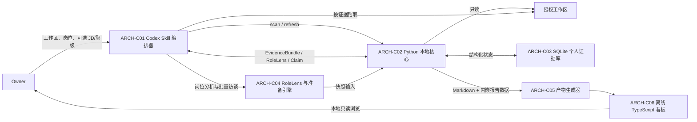

# GoodJob 系统设计

> 状态：待 Owner 核对  
> 权威范围：定义首版系统边界、运行时组件、组件职责、稳定接口、数据流与部署形态  
> 上游：[产品目标](../00-product/vision-and-goals.md)、[产品需求](../10-product/product-requirements.md)、[决策账本](../30-decisions/decision-log.md)  
> 下游：[证据模型](evidence-model.md)、[扫描与分析](scanning-and-analysis.md)、[产物与学习闭环](artifacts-and-learning.md)、[验收基线](../40-delivery/acceptance-baseline.md)

## 1. 设计摘要

GoodJob 是一个由 Codex 显式调用的个人 Skill，而不是独立桌面应用。Codex 负责理解岗位、读取本地证据、生成叙事与开展访谈；随 Skill 分发的 Python 核心负责确定性的发现、索引、SQLite 持久化和产物编排；预构建的 TypeScript 前端只负责渲染无需服务的离线 HTML 看板。

同一份岗位无关证据目录可以被不同 `RoleLens` 重排。源码仍以用户指定工作区内的原文件为事实源；数据库只保存证据指针、哈希、短摘要和结构化结论。版本化 Skill 目录与持续增长的个人数据目录严格分离。



## 2. 运行与部署边界

### 2.1 版本化 Skill 资产

开发期 Skill 位于 GoodJob 仓库的 `.agents/skills/goodjob-career-review/`；发布后安装到用户级 Skill 目录。版本化资产只包括：

- `SKILL.md` 与显式调用元数据；
- Python 源码、数据库迁移和确定性参考数据；
- 岗位分析参考框架；
- 预构建的 TypeScript/CSS/图标资源；
- 运行所需但不含个人信息的模板。

Skill 运行期间不得修改安装目录。升级、重装或删除 Skill 不得影响个人证据库与历史产物（ADR-0001）。

### 2.2 个人数据目录

默认数据根为 `~/.codex/goodjob-career-review/`，可由每次调用的显式 `data-dir` 覆盖。固定布局如下：

```text
~/.codex/goodjob-career-review/
├── config.toml                 # 工作区注册、默认岗位、忽略例外、项目角色信息
├── goodjob.sqlite3             # 证据、运行、访谈与复习状态
├── artifacts/
│   ├── <preparation-run-id>/   # 不可变的 report.zh-CN.md/resume.zh-CN.md/HTML/manifest 主快照
│   └── latest.json             # 原子更新的最新成功中文主快照指针
├── exports/
│   └── <derived-export-id>/    # 从主快照派生的不可变英文材料
├── drafts/                     # Owner 显式导出的可编辑 Markdown 工作稿
└── locks/                      # 单写者进程锁；不承载业务数据
```

个人目录不得进入 Skill 包或 GoodJob Git 仓库。`artifacts/` 保存中文主快照，`exports/` 保存英文派生材料，两者都不保存源码副本；`drafts/` 中的人工工作稿不由 refresh 或 prepare 覆盖。`latest.json` 只指向最近一次成功渲染的中文 `completed` 或带明确缺口的中文 `partial` 主快照，失败运行和英文导出均不得覆盖它。

### 2.3 进程与网络边界

- Codex 仅在 Owner 明确给出的本机可读工作区内读取源码、配置和文档，并可读取 Owner 显式提供的单个本地 JD 文件；扫描器只可沿工作区内 `.git` 指针读取扫描契约定义的根外受限 Git 元数据，不得借此扫描根外项目内容。
- Python 核心作为短生命周期子进程运行；首版没有守护进程、后台监听或常驻 HTTP 服务。
- SQLite 是唯一结构化持久层。前端不得直接打开或修改 SQLite。
- 离线 HTML 不请求远端 API、CDN、字体或分析服务，也不通过 `file://` 再读取外部 JSON；报告数据随 HTML 产物内嵌。
- GoodJob 不引入当前 Codex 会话之外的分析服务、源码上传通道或遥测。Codex 对源码的访问属于当前工作区会话中的直接读取，受该会话既有的数据边界约束；扫描器不额外复制或传输源码。

## 3. 组件职责

| ID | 组件 | 唯一职责 | 明确不负责 |
| --- | --- | --- | --- |
| `ARCH-C01` | Codex Skill 编排器 | 收集输入、选择流程、调用本地核心、控制按证据深读、组织批量访谈并向 Owner 解释结果 | 遍历全工作区、直接写 SQLite、在安装目录保存状态 |
| `ARCH-C02` | Python 本地核心 | 项目发现、确定性扫描、增量索引、证据查询、运行状态与快照编排 | 自行推断岗位价值、冒充用户声明贡献、依赖常驻服务 |
| `ARCH-C03` | SQLite 个人证据库 | 保存岗位无关证据图谱、配置引用、运行快照、结构化访谈和复习状态 | 保存源码全文、作为前端运行时 API |
| `ARCH-C04` | RoleLens 与准备引擎 | 由 Codex 根据岗位/JD/职级构造镜头，按镜头排序证据、形成 Claim、识别知识缺口 | 把岗位限制为固定枚举、重新扫描同一工作区、把文档计划判作已实现 |
| `ARCH-C05` | 产物生成器 | 校验报告契约，生成中文完整报告 Markdown、简历源稿、离线 HTML、显式工作稿、英文派生导出、manifest 和 `latest` | 改写 Claim、隐藏覆盖缺口、覆盖人工工作稿、让派生导出改写主快照 |
| `ARCH-C06` | 离线 TypeScript 看板 | 在浏览器内完成导航、搜索、筛选、证据展开和复习状态展示 | 访问网络、启动服务、持久化新的数据库状态或执行源码扫描 |

### 3.1 `ARCH-C01`：Skill 编排器

Skill 只能由用户显式调用（FR-01）。一次准备会话必须形成 `PreparationRequest`：授权工作区、主岗位、可选 JD、可选职级覆盖、可选英文导出请求和可选数据目录；首版主包语言固定为中文（FR-02、FR-13）。

编排器遵循固定顺序：确认输入 → 确认或刷新索引 → 生成单岗位 `RoleLens` → 请求岗位相关 `EvidenceBundle` → 按缺口打开本地原文件 → 形成 ClaimDraft → 必要时做一次项目级批量访谈 → 由 Python 校验并持久化分析 → 生成不可变准备快照。它不得让 Codex 在无边界的情况下通读全部仓库，也不得绕过 Python 直接把模型草稿写成 ClaimRevision。

### 3.2 `ARCH-C02`：Python 本地核心

Python 核心内部保持四个边界：

1. **Discovery**：识别工作区、项目、Git common-dir、工作树和模块；
2. **Indexer**：按语言适配器提取文件级元数据和证据，记录覆盖与 `ScanIssue`；
3. **Repository**：通过迁移版本化的仓储接口读写 SQLite；
4. **Snapshot/Render**：冻结准备运行的输入并向产物生成器输出版本化 `ReportBundle`。

发现顺序、忽略规则、语言支持和增量算法的唯一契约见[扫描与分析](scanning-and-analysis.md)。实体、状态和快照一致性的唯一契约见[证据模型](evidence-model.md)。

### 3.3 `ARCH-C04`：RoleLens 与准备引擎

`RoleLens` 不是岗位模板枚举，而是一次准备运行中的不可变分析契约（ADR-0004）。它至少包含岗位名、职级、维度与权重、所需证据类别、项目排序规则、输出章节、面试问题策略、知识缺口规则和显式假设。

JD 用于细化岗位与推断职级；显式职级覆盖自动推断。无 JD 时允许生成带可见假设的候选镜头。不同岗位复用同一证据图谱，只改变查询、排序、叙事角度和问题策略（FR-05、NFR-07）。

### 3.4 `ARCH-C05/C06`：产物与前端

Python 向前端提供版本化 `ReportBundle`，前端不得依赖数据库表结构。前端源码使用 TypeScript，构建后的静态资源随 Skill 分发；产出时报告数据内嵌在入口 HTML，所需静态资源可内联或放在同一不可变产物目录中。无论采用哪种打包方式，入口 HTML 都必须可在断网且无本地服务时直接打开。Markdown 和 HTML 必须来自同一冻结快照，且对同一 Claim 呈现相同证据状态与缺口（FR-11、FR-12、NFR-03）。具体章节和学习闭环见[产物与学习闭环](artifacts-and-learning.md)。

## 4. 稳定接口

以下是组件间稳定边界，不要求 Owner 直接使用命令行。所有内部命令以 JSON 向标准输出返回结构化结果；诊断写标准错误；只有请求整体无法建立时返回非零退出码。项目级失败作为 `ScanIssue` 返回，不得误报为全局成功或中断其他项目。

| ID | 发起方 → 接收方 | 接口 | 输入 | 输出与保证 |
| --- | --- | --- | --- | --- |
| `ARCH-I01` | Owner → `ARCH-C01` | `$goodjob-career-review` | `workspace_path`、`target_role`、可选 `jd`、`level_override`、`requested_exports`、`data_dir` | 建立一个可追踪的会话请求；未授权路径不进入扫描；主包固定为中文 |
| `ARCH-I02` | `ARCH-C01` → `ARCH-C02` | `scan` | `ScanRequest(workspace_path, config_revision)` | 首次登记并生成 `ScanRun`、覆盖摘要、问题列表和 workspace/project ID |
| `ARCH-I03` | `ARCH-C01` → `ARCH-C02` | `refresh` | `RefreshRequest(workspace_id, config_revision)` | 显式增量运行；未变化证据保持身份，变化证据生成新版本，失败项目保留并标旧 |
| `ARCH-I04` | `ARCH-C01/C04` → `ARCH-C02/C03` | `prepare_start` | `PreparationRequest` 与待冻结 `RoleLens` | 校验并持久化 JobInput/RoleLens，冻结扫描快照并创建 PreparationRun；返回按 RoleLens 临时优先级组织的 EvidenceBundle，最终排名待 record_analysis 重算 |
| `ARCH-I05` | `ARCH-C04` → `ARCH-C02/C03` | `interview` | `InterviewInput(mode=context\|mock_review, run_id, structured_answers)` | 追加结构化项目上下文或模拟面试复盘；不保存完整逐字对话，不覆盖旧回答 |
| `ARCH-I06` | `ARCH-C04` → `ARCH-C02/C03` | `record_analysis` | `AnalysisCommitRequest`：EvidenceDraft、ClaimDraft、ProjectAssessment 草稿与 KnowledgeGap | 校验深读文件哈希/locator 或定向 Git candidate、facet/反证/作用域/个人归因；按冻结 RoleLens 重算项目分数与稳定排名；原子写入 Evidence、Claim、ProjectAssessment 并冻结分析集 |
| `ARCH-I07` | `ARCH-C01/C04` → `ARCH-C02/C05` | `render` | `ready` 或 `render_failed` 且已冻结分析集的 PreparationRun、主包选项 | 每次创建 RenderAttempt，只从同一已提交分析集原子生成中文 ArtifactSnapshot；成功后更新 latest，失败清理临时产物并允许重试 |
| `ARCH-I08` | `ARCH-C02/C04` → Codex | `EvidenceBundle` | 岗位维度、项目/模块过滤、证据类型、数量上限、可选定向历史目标/理由 | 返回证据指针或受限 Git 候选、短摘要、状态、覆盖和深读建议；绝不返回数据库中的源码全文或 diff 正文 |
| `ARCH-I09` | `ARCH-C05` → `ARCH-C06` | `ReportBundle v1` | 一次冻结 PreparationRun 的岗位、项目、Claim、证据、缺口与复习摘要 | canonical hash 稳定、自包含、可校验版本、无数据库内部表字段耦合、断网可渲染；重试不得改变 bundle hash |
| `ARCH-I10` | `ARCH-C01` → `ARCH-C05` | `translate_export` | `TranslationExportRequest(source_snapshot_id, en, resume+interview_qa)` | 原子生成不可变 `DerivedExport`；不重新扫描、不新增 Claim、不更新 `latest.json` |

`PreparationRequest`、`EvidenceBundle`、`RoleLens`、`Claim`、`ScanIssue`、`ArtifactSnapshot`、`DerivedExport` 的字段与身份规则以[证据模型](evidence-model.md)为准。任何未来破坏性接口修改必须提升对应契约版本并保留旧快照的只读渲染能力。

## 5. 主数据流

### 5.1 首次扫描

1. `ARCH-C01` 校验 Owner 输入的路径、岗位及可选 JD/职级。
2. `ARCH-C02` 发现项目与模块，创建 `ScanRun`，逐项目建立短事务。
3. 每个成功项目写入 `SourceArtifact`、`Evidence`、覆盖摘要和工作树状态；失败写 `ScanIssue`，其余项目继续。
4. 扫描完成后发布一个只读扫描快照。若至少一个项目成功且失败均有记录，运行状态为 `partial`；整体不可建立才为 `failed`。

### 5.2 岗位准备

1. `ARCH-C04` 基于岗位输入、JD 和项目概览生成候选 `RoleLens`，`ARCH-I04` 校验、持久化并冻结它及所用扫描快照。
2. `ARCH-C02` 按该镜头返回有限的 `EvidenceBundle`；Codex 只对关键问题打开原文件并记录所用 SourceRevision/hash。近期历史不足时，Codex 可带理由请求受限的定向 Git candidate；仅对选中的单个 candidate 做有界 diff/blob 深读，内容只进入当前会话而不落库。
3. `ARCH-C04` 将新的精确定位先形成 EvidenceDraft，再形成技术、业务、架构、实现方式、学习、贡献与结果 ClaimDraft。“我实现/负责/主导”必须有项目级 role/ownership 上下文或可核验个人角色 Evidence；“我取得结果”还必须有可核验的项目结果/指标 Evidence。
4. 若业务目标、指标或个人角色仍有关键缺口，`ARCH-C01` 一次性按项目提出批量问题，并追加结构化答案；不逐条确认 Claim。
5. `ARCH-I06` 先校验 EvidenceDraft 的冻结哈希/locator 或定向查询来源，再校验 Evidence 范围、facet、worktree scope 与个人归因门槛且冲突未被隐藏；同时验证每个项目的维度分数/证据/缺口，以冻结 RoleLens 权重重算 final score 与稳定排名；随后原子生成 Evidence、ClaimRevision、ProjectAssessment、PreparationClaim 和 KnowledgeGap，失败时不产生半提交分析集。
6. `ARCH-C05` 只从通过校验的冻结分析集生成同源 Markdown/HTML 主快照。

### 5.3 增量刷新与再准备

1. Owner 显式触发 `refresh`；首版无后台监听。
2. 新扫描运行按内容身份复用未变化记录，对变化内容创建新证据版本，并追加旧证据相对于新 ScanRun 的 `stale` 或 `missing` 时效记录；不得回写旧 Evidence。
3. 已完成的 `PreparationRun` 和产物不可被刷新改写。新的准备运行引用新的扫描快照；历史快照继续显示当时的证据指针与时效状态。

### 5.4 模拟面试与复习

模拟面试读取既有准备快照与知识缺口。结束时只持久化问题标识、结构化摘要、掌握等级、薄弱点和下次复习日期，不保存完整对话。离线看板只展示已持久化状态；状态更新必须回到 Skill/Python 接口（FR-14）。

## 6. 系统不变量与失败行为

| ID | 不变量 |
| --- | --- |
| `ARCH-INV-01` | Skill 安装目录是只读版本资产；全部可变个人状态只能写入解析后的个人数据目录。 |
| `ARCH-INV-02` | 源码原文件是实现事实源；SQLite、Markdown 和 HTML 均不得成为源码副本或取代原文件。 |
| `ARCH-INV-03` | 每个关键 Claim 至少关联一个当前或被明确标旧的 Evidence；无证据不得伪装为代码事实。 |
| `ARCH-INV-04` | 计划/设计文档只能支持“已规划/已文档化”；测试定义只支持“存在测试”，只有匹配 revision/commit 的通过结果元数据才支持“测试已验证”。 |
| `ARCH-INV-05` | “我实现/负责/主导”必须关联有效 role/ownership 上下文或可核验个人角色 Evidence；“我取得结果”还必须关联可核验项目结果/指标 Evidence。仅从仓库结构或 Git 作者推断不足以成立。 |
| `ARCH-INV-06` | 一个损坏、无权限或未支持项目不阻断其余项目；任何降级必须进入覆盖摘要和最终产物。 |
| `ARCH-INV-07` | Markdown 与 HTML 必须由同一 `PreparationRun` 快照产生；不得在渲染阶段重新分析或改变 Claim。 |
| `ARCH-INV-08` | 完成后的 RoleLens、PreparationRun、ArtifactSnapshot 和 DerivedExport 不可原地改写；修订产生新版本或新运行。 |
| `ARCH-INV-09` | 离线看板在断网、无本地服务时仍可使用全部阅读、搜索、筛选和证据展开功能。 |
| `ARCH-INV-10` | 扫描器和产物不得静默越过授权根、敏感项硬排除或外层 ignore 与嵌套仓库隔离规则。 |
| `ARCH-INV-11` | 工作区、JD、用户上下文和模型输出都是不可信数据：不能改变控制流或权限；进入 HTML 时必须安全编码，不能产生可执行标记、脚本、事件处理器或外部 URL。 |
| `ARCH-INV-12` | 多 worktree 相同内容只复用解析/折叠展示，不合并 provenance；分支差异必须保留 worktree scope 或显式冲突，不能拼成一个不存在的项目状态。 |
| `ARCH-INV-13` | record_analysis 成功后，渲染重试只能复用冻结分析集；失败只追加 RenderAttempt，不重新生成 Claim、不发布半成品、不更新 latest。 |

首版使用单写者策略：同一数据目录的写操作必须先取得进程锁；读取可并行。一次项目索引在单个 SQLite 事务内提交，项目事务失败不得污染该项目上一份已发布快照。数据库迁移必须先完整成功，再允许扫描或导出；无法迁移时停止写入并保留原库。

## 7. 需求到组件映射

| 需求 | 主责组件/接口 | 架构验收关注点 |
| --- | --- | --- |
| `FR-01`、`FR-02` | `ARCH-C01`、`ARCH-I01` | 显式会话；工作区、岗位、JD、职级覆盖均可表达 |
| `FR-03`、`FR-04` | `ARCH-C02/C03`、`ARCH-I02/I03` | 项目/模块发现可追踪；显式增量不改写历史快照 |
| `FR-05`、`FR-06` | `ARCH-C04`、`ARCH-I04/I06/I08` | 动态单岗位镜头；有限证据包后再按需深读；模型草稿经校验才持久化 |
| `FR-07`、`FR-10` | `ARCH-C01/C04`、`ARCH-I05/I06` | 能力叙事与个人贡献分层；缺口采用项目级批量访谈；强归因门槛可执行 |
| `FR-08`、`FR-09`、`FR-11` | `ARCH-C04/C05`、`ARCH-I06/I07/I09` | 完整准备包；跨项目排序后仍保留项目、模块和证据追溯 |
| `FR-12` | `ARCH-C05/C06`、`ARCH-I07/I09` | 中文同源不可变 Markdown/HTML；latest 只指向成功主快照 |
| `FR-13` | `ARCH-C01/C05`、`ARCH-I10` | 英文简历与问答从中文主快照派生，不产生英文 HTML 或平行事实库 |
| `FR-14` | `ARCH-C01/C03/C04`、`ARCH-I05` | 只保存结构化复盘和日期；无主动提醒 |
| `FR-15` | `ARCH-C02/C05` | 部分失败可继续且覆盖缺口进入产物 |
| `NFR-01`、`NFR-02` | `ARCH-C02/C03`、`ARCH-INV-02/10` | 本地只读源码、最小证据持久化、证据时效可见 |
| `NFR-03` | `ARCH-C05/C06`、`ARCH-INV-09` | 无服务、无远端依赖、单机离线可读 |
| `NFR-04`、`NFR-05` | `ARCH-C02/C03/C05` | 增量与快照一致；失败可见且不产生虚假完整性 |
| `NFR-06` | `ARCH-C01/C03`、`ARCH-INV-01` | Skill 升级不触碰个人状态 |
| `NFR-07` | `ARCH-C02/C04` | 语言适配器和动态 RoleLens 可扩展，不改写基础证据模型 |
| `NFR-08` | `ARCH-C01/C02/C05/C06`、`ARCH-I06`、`ARCH-INV-11` | 项目/JD 指令不被执行；模型草稿需校验；HTML 数据不能变成代码 |

## 8. 首版边界

首版每次只准备一个主岗位；多岗位并排比较不进入实现。首版深读语言、扫描细节和未来适配器见[扫描与分析](scanning-and-analysis.md)。不实现后台监听、主动复习提醒、公开发布、常驻服务或独立桌面程序。以上未来能力不得以“顺便实现”的方式进入首版。
